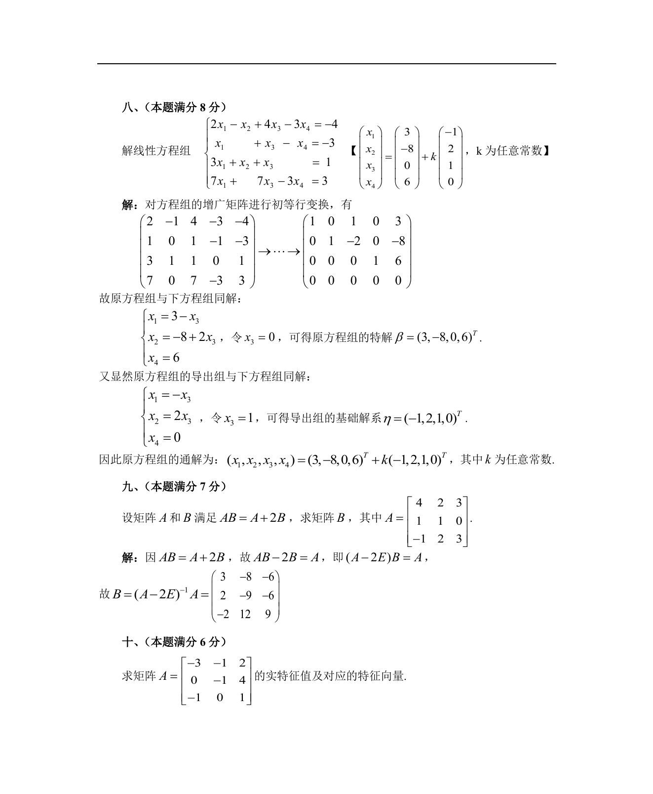

# 1987 数学三第 20 题

## 题目

假设矩阵$A$和$B$满足如下关系式$AB = A + 2B$，其中$A = \begin{pmatrix}
4 & 2 & 3 \\
1 & 1 & 0 \\
-1 & 2 & 3
\end{pmatrix}$，求矩阵$B$．

## 标准答案

见答案解析页图

## 解析

解析见下方答案解析页图；PDF 文本层公式不稳定，未直接转写为 LaTeX。

## 答案解析页图

## 来源

- 题目来源：1987 年数学三 TeX 试卷源（试卷四）。
- 答案解析来源：1987数学三真题答案解析（试卷四）.pdf。
- 页面图只作为原卷/解析复核依据；题干正文已按 TeX 源整理为 LaTeX。
