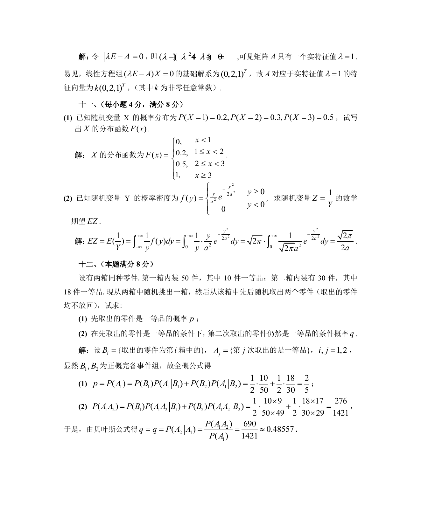

# 1987 数学三第 24 题

## 题目

假设有两箱同种零件：第一箱内装$50$件，其中$10$件一等品；第二箱内装$30$件，其中$18$件一等品，
现从两箱中任意挑出一箱，然后从该箱中先后随机取出两个零件（取出的零件均不放回）．试求：

1. 先取出的零件是一等品的概率$p$；
2. 在先取出的是一等品的条件下，第二次取出的零件仍然是一等品的条件概率$q$．

## 标准答案

见答案解析页图

## 解析

解析见下方答案解析页图；PDF 文本层公式不稳定，未直接转写为 LaTeX。

## 答案解析页图

## 来源

- 题目来源：1987 年数学三 TeX 试卷源（试卷四）。
- 答案解析来源：1987数学三真题答案解析（试卷四）.pdf。
- 页面图只作为原卷/解析复核依据；题干正文已按 TeX 源整理为 LaTeX。
