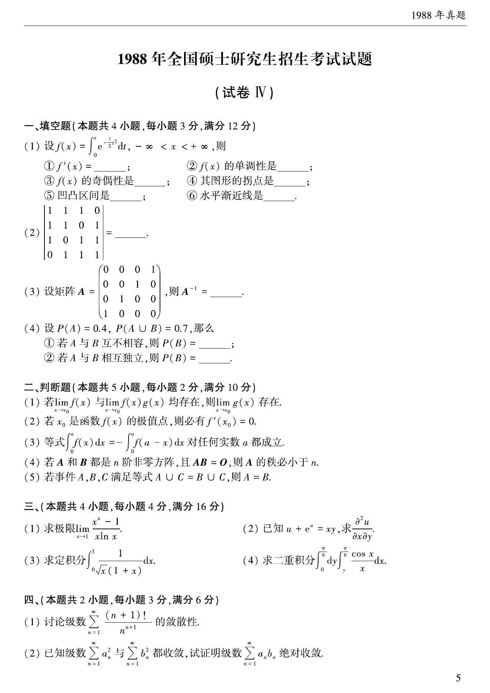
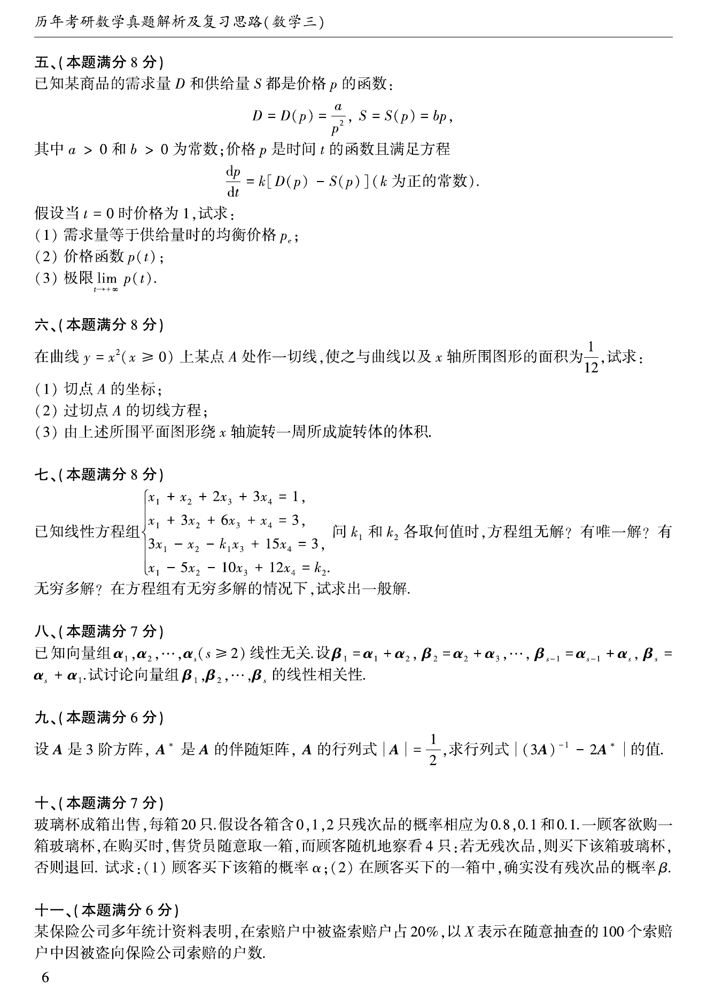
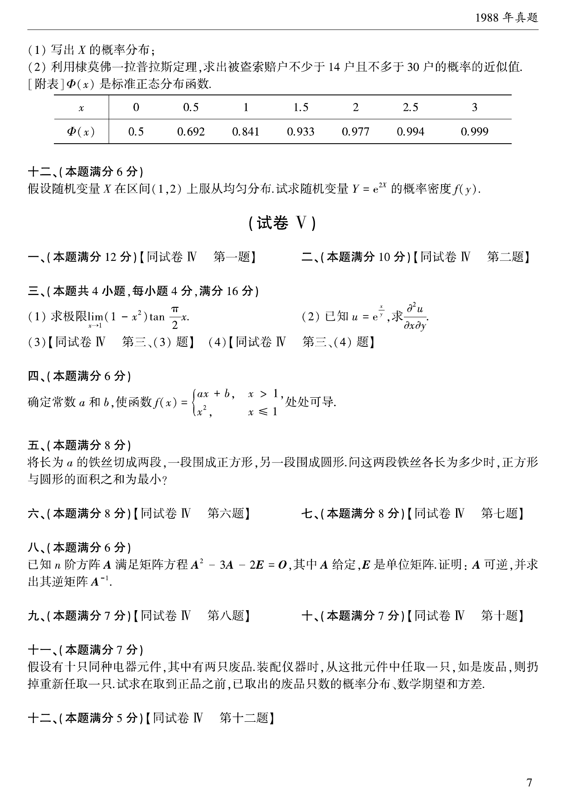

# 1988 年考研数学三真题

资料类型：考研数学三历年真题
年份：1988
科目：数学三
整理状态：TeX 题干源整理，答案解析 PDF 文本层拆分

## 原卷页图

## 填空题（本题满分12分，每空1分）

### 第 1 题

- 题型：填空题
- 题号：1
- 分值：待复核
- 模块：高等数学
- 校对状态：已按 TeX 源整理

已知函数$f(x)=\int_0^x\mathrm{e}^{-\frac{1}{2}t^2}\,\mathrm{d}t$，$-\infty<x<+\infty$，则

(a) $f'(x)=$ ____；

(b) $f(x)$的单调性：____；

(c) $f(x)$的奇偶性：____；

(d) $f(x)$的图形的拐点：____；

(e) $f(x)$图形的凹凸性：____，____；

(f) $f(x)$图形的水平渐近线：____，____．

### 第 2 题

- 题型：填空题
- 题号：2
- 分值：待复核
- 模块：高等数学
- 校对状态：已按 TeX 源整理

$\begin{vmatrix}
1 & 1 & 1 & 0 \\
1 & 1 & 0 & 1 \\
1 & 0 & 1 & 1 \\
0 & 1 & 1 & 1
\end{vmatrix}=$ ____．

### 第 3 题

- 题型：填空题
- 题号：3
- 分值：待复核
- 模块：高等数学
- 校对状态：已按 TeX 源整理

$\begin{pmatrix}
0 & 0 & 0 & 1 \\
0 & 0 & 1 & 0 \\
0 & 1 & 0 & 0 \\
1 & 0 & 0 & 0
\end{pmatrix}^{-1}=$ ____．

### 第 4 题

- 题型：填空题
- 题号：4
- 分值：待复核
- 模块：高等数学
- 校对状态：已按 TeX 源整理

假设$P(A)=0.4$，$P(A\cup B)=0.7$，那么

(a) 若$A$与$B$互不相容，则$P(B)=$ ____；

(b) 若$A$与$B$相互独立，则$P(B)=$ ____．

## 判断题（本题满分10分，每小题2分）

### 第 5 题

- 题型：判断题
- 题号：5
- 分值：2
- 模块：高等数学
- 校对状态：已按 TeX 源整理

若极限$\lim_{x \to x_0} f(x)$与$\lim_{x \to x_0} f(x)g(x)$都存在，
则极限$\lim_{x \to x_0} g(x)$必存在．（ ）

### 第 6 题

- 题型：判断题
- 题号：6
- 分值：2
- 模块：高等数学
- 校对状态：已按 TeX 源整理

若$x_0$是函数$f(x)$的极值点，则必有$f'(x_0) = 0$． （ ）

### 第 7 题

- 题型：判断题
- 题号：7
- 分值：2
- 模块：高等数学
- 校对状态：已按 TeX 源整理

等式$\int_0^a f(x)\,\mathrm{d}x = -\int_0^a f(a-x)\,\mathrm{d}x$对任何实数$a$都成立．（ ）

### 第 8 题

- 题型：判断题
- 题号：8
- 分值：2
- 模块：线性代数
- 校对状态：已按 TeX 源整理

若$A$和$B$都是$n$阶非零方阵，且$AB=0$，则$A$的秩必小于$n$． （ ）

### 第 9 题

- 题型：判断题
- 题号：9
- 分值：2
- 模块：高等数学
- 校对状态：已按 TeX 源整理

若事件$A$, $B$, $C$满足等式$A\cup C = B \cup C$，则$A=B$． （ ）

## 计算题（本题满分16分，每小题4分）

### 第 10 题

- 题型：解答题
- 题号：10
- 分值：4
- 模块：高等数学
- 校对状态：已按 TeX 源整理

求极限$\lim_{x \to 1} \frac{x^x - 1}{x\ln x}$．

### 第 11 题

- 题型：解答题
- 题号：11
- 分值：4
- 模块：高等数学
- 校对状态：已按 TeX 源整理

已知$u + \mathrm{e}^u = xy$，求$\frac{

tial^2 u}{

tialx

tial y}$．

### 第 12 题

- 题型：解答题
- 题号：12
- 分值：4
- 模块：高等数学
- 校对状态：已按 TeX 源整理

求定积分$\int_0^3\frac{\,\mathrm{d}x}{\sqrt{x}(1 + x)}$．

### 第 13 题

- 题型：解答题
- 题号：13
- 分值：4
- 模块：高等数学
- 校对状态：已按 TeX 源整理

求二重积分$\int_0^{\frac{\pi}{6}} \,\mathrm{d}y \int_y^{\frac{\pi}{6}} \frac{\cos x}{x}\,\mathrm{d}x$．

## 解答题（本题满分6分，每小题3分）

### 第 14 题

- 题型：解答题
- 题号：14
- 分值：3
- 模块：高等数学
- 校对状态：已按 TeX 源整理

讨论级数$\sum_{n = 1}^{\infty}\frac{(n + 1)!}{n^{(n + 1)}}$的敛散性．

### 第 15 题

- 题型：解答题
- 题号：15
- 分值：3
- 模块：高等数学
- 校对状态：已按 TeX 源整理

已知级数$\sum_{n = 1}^{\infty}a_n^2$和$\sum_{n = 1}^{\infty}b_n^2$都收敛，
试证明级数$\sum_{n = 1}^{\infty}a_n b_n$绝对收敛，

## 第 5 部分（本题满分8分）

### 第 16 题

- 题型：解答题
- 题号：16
- 分值：8
- 模块：高等数学
- 校对状态：已按 TeX 源整理

已知某商品的需求量$D$和供给量$S$都是价格$p$的函数：
$$D = D(p) = \frac{a}{p^2}, S = S(p) = bp,$$
其中$a > 0$和$b > 0$为常数；价格$p$是时间$t$的函数且满足方程
$$\frac{\mathrm{d} p}{\,\mathrm{d}t}=k[D(p)-S(p)] （$k$为正的常数）.$$
假设当$t = 0$时价格为$1$，试求

1. 需求量等于供给量时的均衡价格$p_e$；
2. 价格函数$p(t)$；
3. 极限$\lim_{t \to +\infty} p(t)$．

## 第 6 部分（本题满分8分）

### 第 17 题

- 题型：解答题
- 题号：17
- 分值：8
- 模块：高等数学
- 校对状态：已按 TeX 源整理

在曲线$y = x^2$（$x > 0$）上某点$A$处作一切线，
使之与曲线以及$x$轴所围图形的面积为$\frac{1}{12}$．试求：

1. 切点$A$的坐标；
2. 过切点$A$的切线方程；
3. 由上述所围平面图形绕$x$轴旋转一周所成旋转体的体积．

## 第 7 部分（本题满分8分）

### 第 18 题

- 题型：解答题
- 题号：18
- 分值：8
- 模块：线性代数
- 校对状态：已按 TeX 源整理

已给线性方程组$\begin{cases}
x_1 + x_2 + 2x_3 + 3x_4 = 1, \\
x_1 + 3x_2 + 6x_3 + x_4 = 3, \\
3x_1 - x_2 - k_1x_3 + 15x_4 = 3, \\
x_1 - 5x_2 - 10x_3 + 12x_4 = k_2.
\end{cases}$问$k_1$和$k_2$各取何值时，方程组无解？有唯一解？有无穷多解？
在方程组有无穷多组解的情形下，试求出一般解．

## 第 8 部分（本题满分7分）

### 第 19 题

- 题型：解答题
- 题号：19
- 分值：7
- 模块：线性代数
- 校对状态：已按 TeX 源整理

已知向量组$\alpha_1,\alpha_2, \cdots ,\alpha_s$ ($s \ge 2$)线性无关．设
$$\beta_1 = \alpha_1 + \alpha_2, \beta_2 = \alpha_2 + \alpha_3, \cdots,
\beta_{s - 1} = \alpha_{s - 1} + \alpha_s, \beta_s = \alpha_s + \alpha_1.$$
试讨论向量组$\beta_1,\beta_2, \cdots ,\beta_s$的线性相关性．

## 第 9 部分（本题满分6分）

### 第 20 题

- 题型：解答题
- 题号：20
- 分值：6
- 模块：线性代数
- 校对状态：已按 TeX 源整理

设$A$是三阶方阵，$A^*$是$A$的伴随矩阵，$A$的行列式$|A| = \frac{1}{2}$．
求行列式$\left|(3A)^{-1} - 2A^*\right|$的值．

## 第 10 部分（本题满分7分）

### 第 21 题

- 题型：解答题
- 题号：21
- 分值：7
- 模块：概率统计
- 校对状态：已按 TeX 源整理

玻璃杯成箱出售，每箱$20$只，假设各箱含$0$, $1$, $2$只残次品的概率相应为$0.8$, $0.1$ 和$0.1$．
一顾客欲购一箱玻璃杯，在购买时，售货员随意取一箱，顾客开箱随机地察看$4$只：
若无残次品，则买下该箱玻璃杯，否则退回．试求：

1. 顾客买下该箱的概率$\alpha$；
2. 在顾客买下的一箱中，确实没有残次品的概率$\beta$．

## 第 11 部分（本题满分6分）

### 第 22 题

- 题型：解答题
- 题号：22
- 分值：6
- 模块：概率统计
- 校对状态：已按 TeX 源整理

某保险公司多年的统计资料表明，在索赔户中被盗索赔户占$20\%$，
以$X$表示在随意抽查的$100$个索赔户中因被盗向保险公司索赔的户数．

1. 写出$X$的概率分布；
2. 利用棣莫佛—拉普拉斯定理，求被盗索赔户不少于$14$户且不多于$30$户的概率的近似值．

\centerline{[附表]设$\Phi(x)$是标准正态分布函数．}
\centerline{$\begin{array}{|c|ccccccc|}
\hline
x & 0 & 0.5 & 1.0 & 1.5 & 2.0 & 2.5 & 3.0 \\
\hline
\Phi(x) & 0.500 & 0.692 & 0.841 & 0.933 & 0.977 & 0.994 & 0.999 \\
\hline
\end{array}$}

## 第 12 部分（本题满分6分）

### 第 23 题

- 题型：解答题
- 题号：23
- 分值：6
- 模块：概率统计
- 校对状态：已按 TeX 源整理

假设随机变量$X$在区间$(1,2)$上服从均匀分布，试求随机变量$Y = \mathrm{e}^{2X}$的概率密度$f_Y(y)$．
