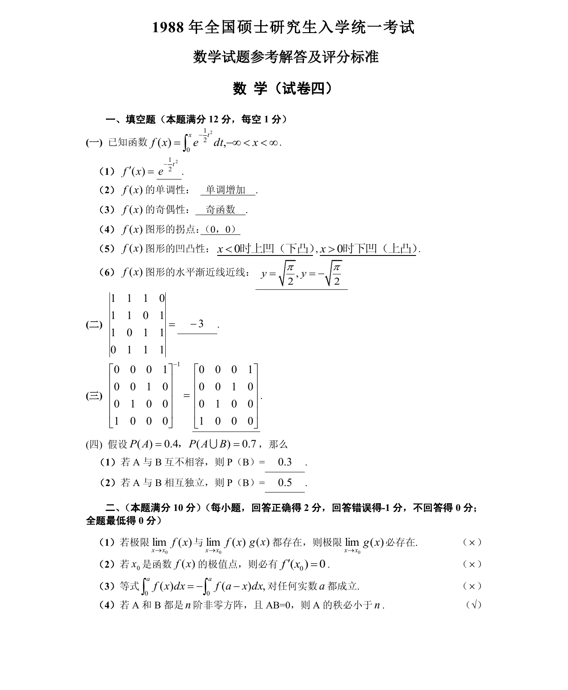

# 1988 数学三第 2 题

## 题目

$\begin{vmatrix}
1 & 1 & 1 & 0 \\
1 & 1 & 0 & 1 \\
1 & 0 & 1 & 1 \\
0 & 1 & 1 & 1
\end{vmatrix}=$ \underline{\qquad}．

## 标准答案

见答案解析页图

## 解析

该题答案见下方答案解析页图；PDF 文本层顺序和公式不稳定，未直接转写为标准 LaTeX 文本。

## 答案解析页图

## 来源

- 题目来源：1988 年数学三 TeX 试卷源（试卷四）。
- 答案解析来源：1988数学三真题答案解析（试卷四）.pdf。
- 页面图只作为原卷/解析复核依据；题干正文已按 TeX 源整理为 LaTeX。
