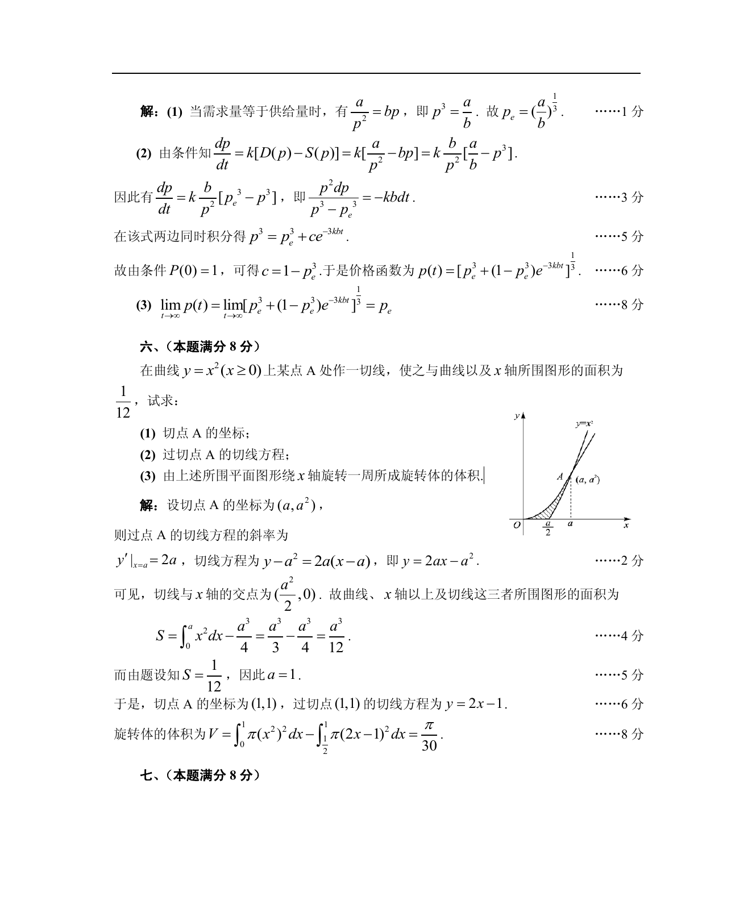

# 1988 数学三第 16 题

## 题目

已知某商品的需求量$D$和供给量$S$都是价格$p$的函数：
$$D = D(p) = \frac{a}{p^2}, S = S(p) = bp,$$
其中$a > 0$和$b > 0$为常数；价格$p$是时间$t$的函数且满足方程
$$\frac{\mathrm{d} p}{\,\mathrm{d}t}=k[D(p)-S(p)] （$k$为正的常数）.$$
假设当$t = 0$时价格为$1$，试求

1. 需求量等于供给量时的均衡价格$p_e$；
2. 价格函数$p(t)$；
3. 极限$\lim_{t \to +\infty} p(t)$．

## 标准答案

见答案解析页图

## 解析

解析见下方答案解析页图；PDF 文本层公式不稳定，未直接转写为 LaTeX。

## 答案解析页图

## 来源

- 题目来源：1988 年数学三 TeX 试卷源（试卷四）。
- 答案解析来源：1988数学三真题答案解析（试卷四）.pdf。
- 页面图只作为原卷/解析复核依据；题干正文已按 TeX 源整理为 LaTeX。
