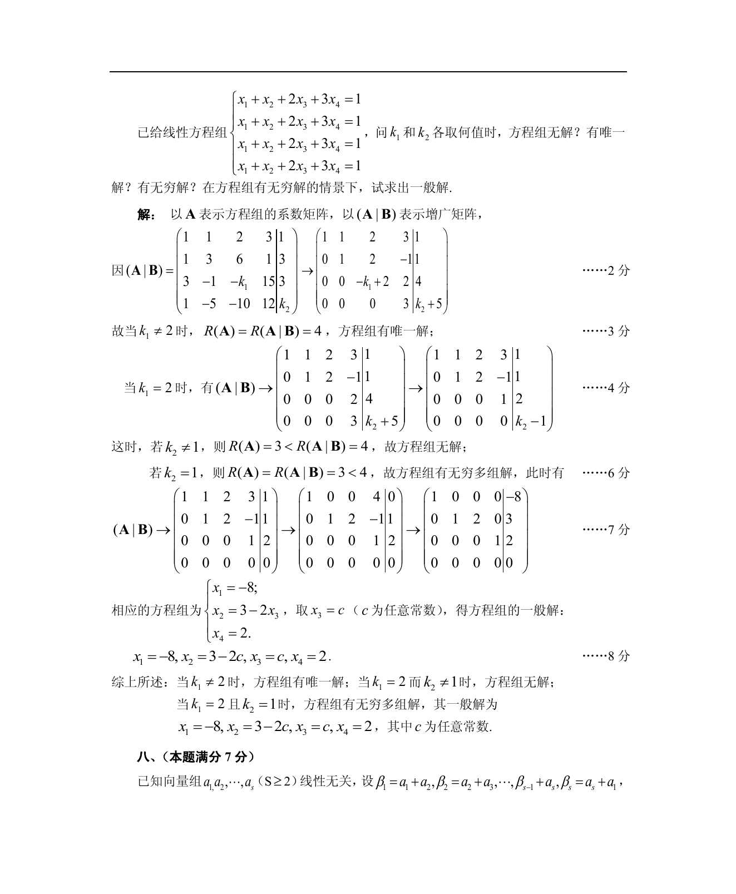

# 1988 数学三第 18 题

## 题目

已给线性方程组$\begin{cases}
x_1 + x_2 + 2x_3 + 3x_4 = 1, \\
x_1 + 3x_2 + 6x_3 + x_4 = 3, \\
3x_1 - x_2 - k_1x_3 + 15x_4 = 3, \\
x_1 - 5x_2 - 10x_3 + 12x_4 = k_2.
\end{cases}$问$k_1$和$k_2$各取何值时，方程组无解？有唯一解？有无穷多解？
在方程组有无穷多组解的情形下，试求出一般解．

## 标准答案

见答案解析页图

## 解析

解析见下方答案解析页图；PDF 文本层公式不稳定，未直接转写为 LaTeX。

## 答案解析页图

## 来源

- 题目来源：1988 年数学三 TeX 试卷源（试卷四）。
- 答案解析来源：1988数学三真题答案解析（试卷四）.pdf。
- 页面图只作为原卷/解析复核依据；题干正文已按 TeX 源整理为 LaTeX。
