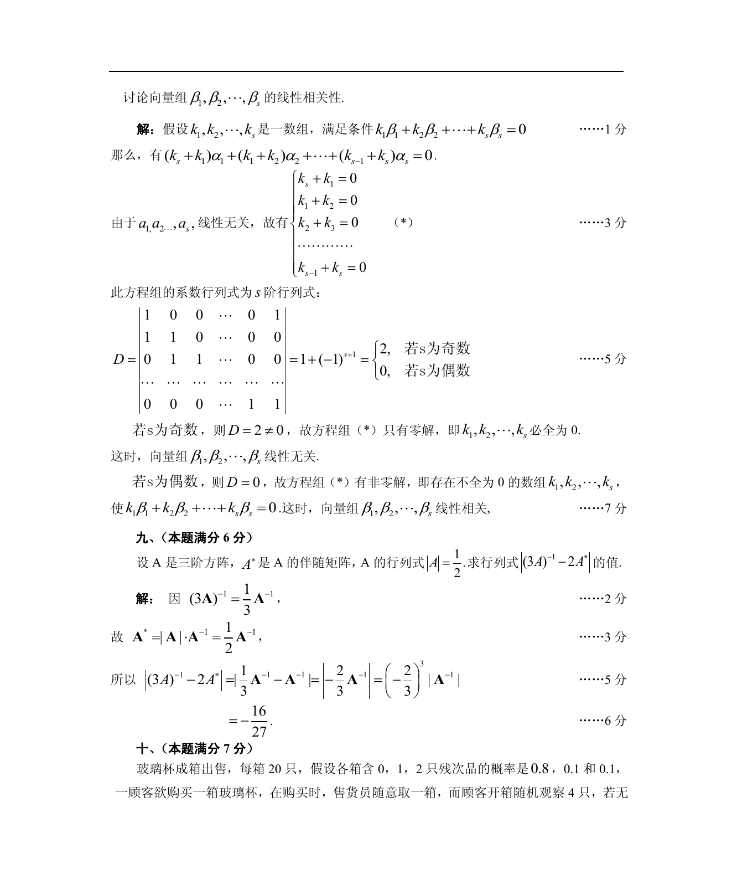

# 1988 数学三第 19 题

## 题目

已知向量组$\alpha_1,\alpha_2, \cdots ,\alpha_s$ ($s \ge 2$)线性无关．设
$$\beta_1 = \alpha_1 + \alpha_2, \beta_2 = \alpha_2 + \alpha_3, \cdots,
\beta_{s - 1} = \alpha_{s - 1} + \alpha_s, \beta_s = \alpha_s + \alpha_1.$$
试讨论向量组$\beta_1,\beta_2, \cdots ,\beta_s$的线性相关性．

## 标准答案

见答案解析页图

## 解析

解析见下方答案解析页图；PDF 文本层公式不稳定，未直接转写为 LaTeX。

## 答案解析页图

## 来源

- 题目来源：1988 年数学三 TeX 试卷源（试卷四）。
- 答案解析来源：1988数学三真题答案解析（试卷四）.pdf。
- 页面图只作为原卷/解析复核依据；题干正文已按 TeX 源整理为 LaTeX。
