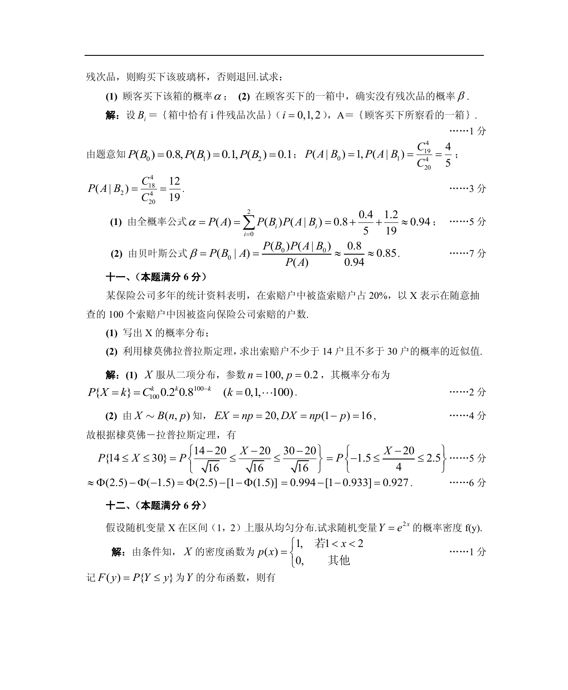

# 1988 数学三第 22 题

## 题目

某保险公司多年的统计资料表明，在索赔户中被盗索赔户占$20\%$，
以$X$表示在随意抽查的$100$个索赔户中因被盗向保险公司索赔的户数．

1. 写出$X$的概率分布；
2. 利用棣莫佛—拉普拉斯定理，求被盗索赔户不少于$14$户且不多于$30$户的概率的近似值．

\centerline{[附表]设$\Phi(x)$是标准正态分布函数．}
\centerline{$\begin{array}{|c|ccccccc|}
\hline
x & 0 & 0.5 & 1.0 & 1.5 & 2.0 & 2.5 & 3.0 \\
\hline
\Phi(x) & 0.500 & 0.692 & 0.841 & 0.933 & 0.977 & 0.994 & 0.999 \\
\hline
\end{array}$}

## 标准答案

见答案解析页图

## 解析

解析见下方答案解析页图；PDF 文本层公式不稳定，未直接转写为 LaTeX。

## 答案解析页图

## 来源

- 题目来源：1988 年数学三 TeX 试卷源（试卷四）。
- 答案解析来源：1988数学三真题答案解析（试卷四）.pdf。
- 页面图只作为原卷/解析复核依据；题干正文已按 TeX 源整理为 LaTeX。
