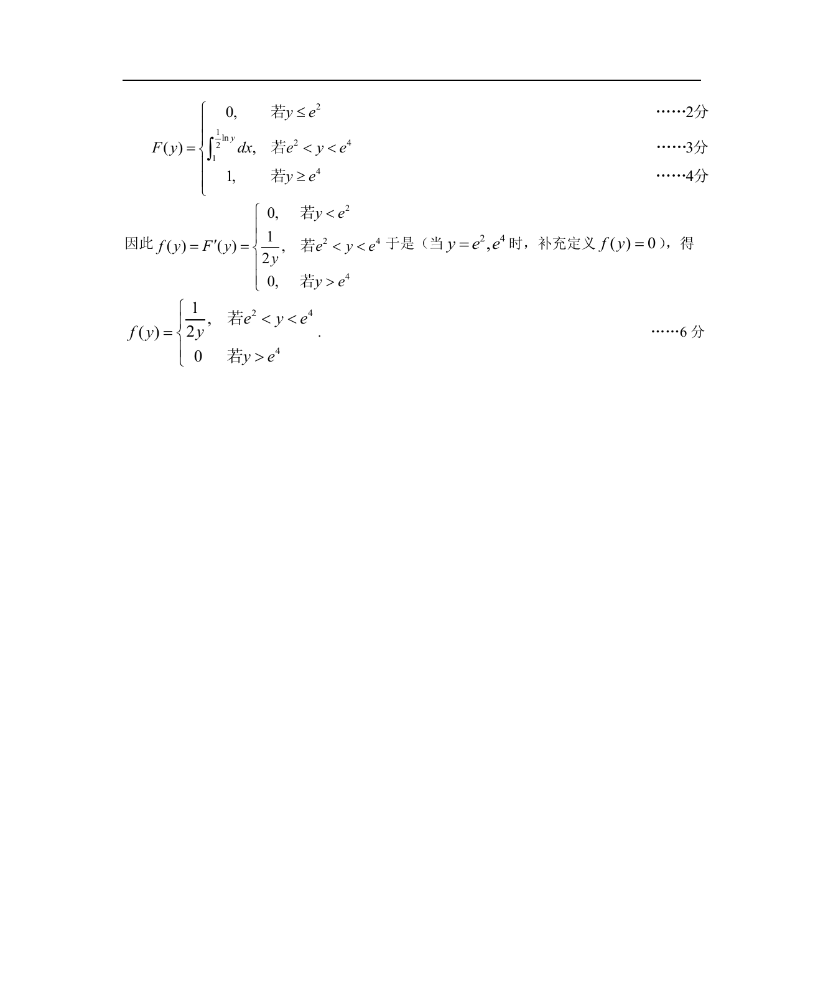

# 1988 数学三第 23 题

## 题目

假设随机变量$X$在区间$(1,2)$上服从均匀分布，试求随机变量$Y = \mathrm{e}^{2X}$的概率密度$f_Y(y)$．

## 标准答案

见答案解析页图

## 解析

解析见下方答案解析页图；PDF 文本层公式不稳定，未直接转写为 LaTeX。

## 答案解析页图

## 来源

- 题目来源：1988 年数学三 TeX 试卷源（试卷四）。
- 答案解析来源：1988数学三真题答案解析（试卷四）.pdf。
- 页面图只作为原卷/解析复核依据；题干正文已按 TeX 源整理为 LaTeX。
