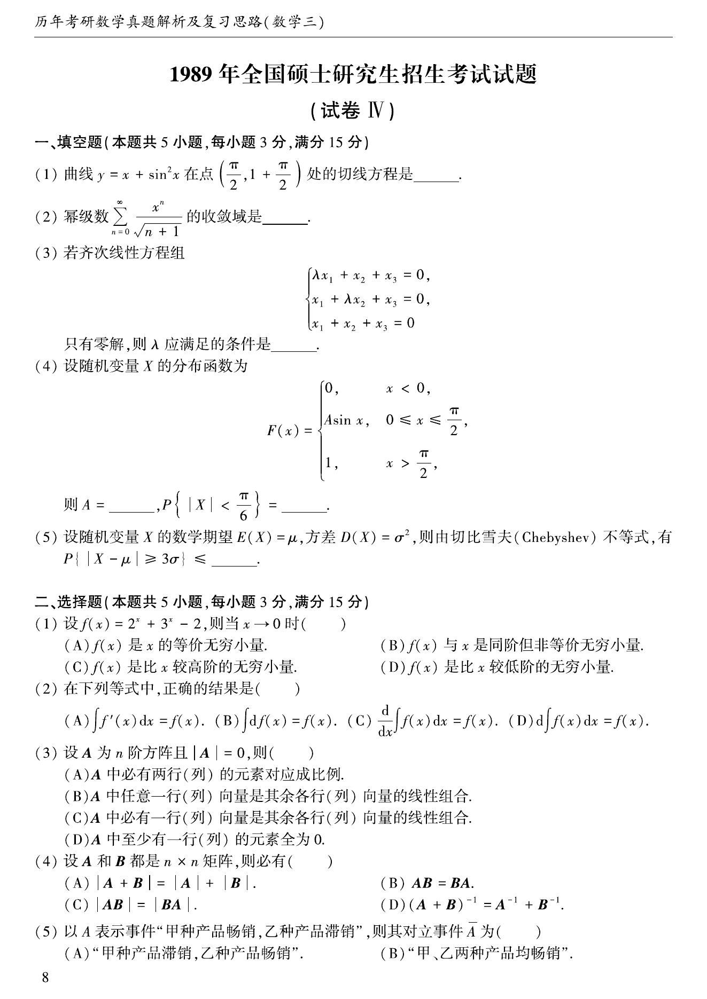
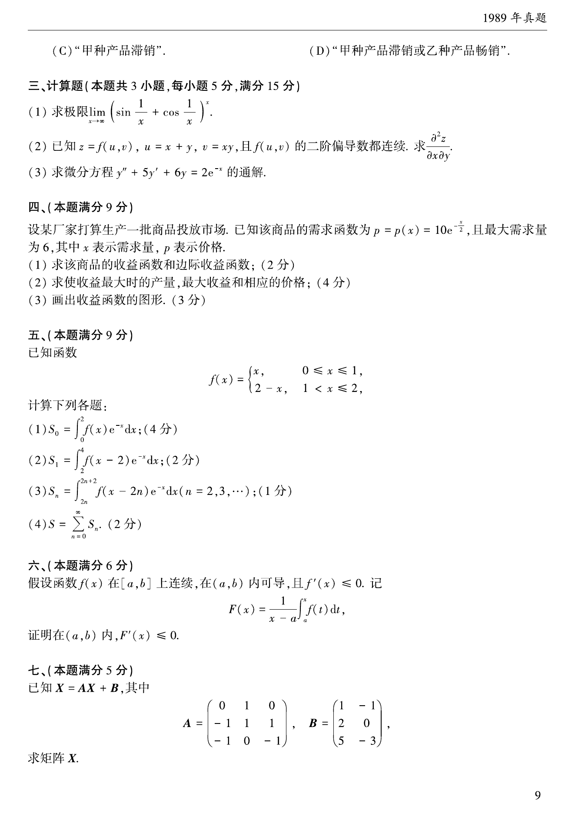
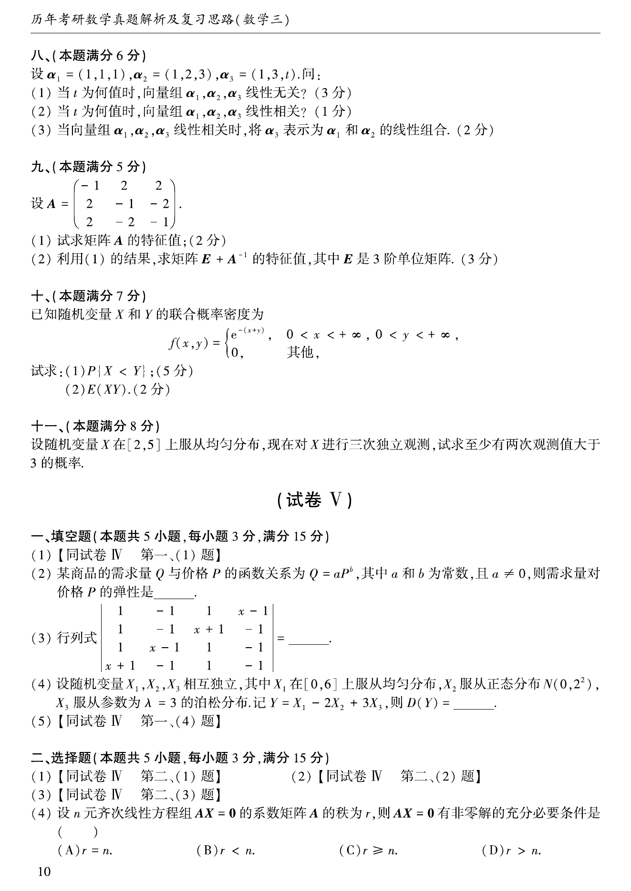

# 1989 年考研数学三真题

资料类型：考研数学三历年真题
年份：1989
科目：数学三
整理状态：TeX 题干源整理，答案解析 PDF 文本层拆分

## 原卷页图

## 填空题（本题满分15分，每小题3分）

### 第 1 题

- 题型：填空题
- 题号：1
- 分值：3
- 模块：高等数学
- 校对状态：已按 TeX 源整理

曲线$y=x+\sin^2 x$在点$\left(\frac{\pi}{2},1+\frac{\pi}{2}\right)$处的切线方程是____.

### 第 2 题

- 题型：填空题
- 题号：2
- 分值：3
- 模块：高等数学
- 校对状态：已按 TeX 源整理

幂级数$\sum_{n=0}^{\infty}\frac{x^n}{\sqrt{n+1}}$的收敛域是____.

### 第 3 题

- 题型：填空题
- 题号：3
- 分值：3
- 模块：线性代数
- 校对状态：已按 TeX 源整理

齐次线性方程组$\begin{cases}
\lambda x_1+x_2+x_3=0, \\
x_1+\lambda x_2+x_3=0, \\
x_1+x_2+x_3=0 \\
\end{cases}$只有零解，则$\lambda$应满足的条件是____.

### 第 4 题

- 题型：填空题
- 题号：4
- 分值：3
- 模块：概率统计
- 校对状态：已按 TeX 源整理

设随机变量$X$的分布函数为
$$F(x)=\begin{cases}
0, & x<0, \\
A\sin x, & 0\le x\le \frac{\pi}{2}, \\
1, & x>\frac{\pi}{2},
\end{cases}$$
则$A=$____，$P\left\{|X|<\frac{\pi}{6}\right\}=$____．

### 第 5 题

- 题型：填空题
- 题号：5
- 分值：3
- 模块：概率统计
- 校对状态：已按 TeX 源整理

设随机变量$X$的数学期望$E(X)=\mu$，方差$D(X)=\sigma^2$,
则由切比雪夫(Chebyshev)不等式，有$P\{|X-\mu|\ge 3\sigma\}\le$ ____．

## 选择题（本题满分15分，每小题3分）

### 第 6 题

- 题型：选择题
- 题号：6
- 分值：3
- 模块：高等数学
- 校对状态：已按 TeX 源整理

设$f(x)=2^x+3^x-2$，则当$x\to 0$时 （ ）

A. $f(x)$与$x$是等价无穷小量．

B. $f(x)$与$x$是同阶但非等价无穷小量．

C. $f(x)$是比$x$较高阶的无穷小量．

D. $f(x)$是比$x$较低阶的无穷小量．

### 第 7 题

- 题型：选择题
- 题号：7
- 分值：3
- 模块：高等数学
- 校对状态：已按 TeX 源整理

在下列等式中，正确的结果是 （ ）

A. $\int f'(x)\,\mathrm{d}x=f(x)$．

B. $\int \mathrm{d} f(x)=f(x)$．

C. $\frac{\d}{\,\mathrm{d}x}\int f(x)\,\mathrm{d}x=f(x)$．

D. $\d\int f(x)\,\mathrm{d}x=f(x)$．

### 第 8 题

- 题型：选择题
- 题号：8
- 分值：3
- 模块：线性代数
- 校对状态：已按 TeX 源整理

设$A$是$n$阶矩阵，且$A$的行列式$|A|=0$，则$A$中（ ）

A. 必有一列元素全为$0$．

B. 必有两列元素对应成比例．

C. 必有一列向量是其余列向量的线性组合．

D. 任一列向量是其余列向量的线性组合．

### 第 9 题

- 题型：选择题
- 题号：9
- 分值：3
- 模块：线性代数
- 校对状态：已按 TeX 源整理

设$A$和$B$均为$n\times n$矩阵，则必有 （ ）

A. $|A+B|=|A|+|B|$．

B. $AB=BA$．

C. $|AB|=|BA|$．

D. $(A+B)^{-1}=A^{-1}+B^{-1}$．

### 第 10 题

- 题型：选择题
- 题号：10
- 分值：3
- 模块：高等数学
- 校对状态：已按 TeX 源整理

以$A$表示事件“甲种产品畅销，乙种产品滞销”，则其对立事件$\overline{A}$为 （ ）

A. “甲种产品滞销，乙种产品畅销”．

B. “甲、乙两种产品均畅销”．

C. “甲种产品滞销”．

D. “甲种产品滞销或乙种产品畅销”．

## 计算题（本题满分15分，每小题5分）

### 第 11 题

- 题型：解答题
- 题号：11
- 分值：5
- 模块：高等数学
- 校对状态：已按 TeX 源整理

求极限$\lim_{x\to \infty}\left(\sin\frac{1}{x}+\cos\frac{1}{x}\right)^x$．

### 第 12 题

- 题型：解答题
- 题号：12
- 分值：5
- 模块：高等数学
- 校对状态：已按 TeX 源整理

已知$z=f(u,v),u=x+y,v=xy$，且$f(u,v)$的二阶偏导数都连续．
求$\frac{

tial^2 z}{

tialx

tial y}$．

### 第 13 题

- 题型：解答题
- 题号：13
- 分值：5
- 模块：高等数学
- 校对状态：已按 TeX 源整理

求微分方程$y''+5y'+6y=2\mathrm{e}^{-x}$的通解．

## 第 4 部分（本题满分9分）

### 第 14 题

- 题型：解答题
- 题号：14
- 分值：9
- 模块：高等数学
- 校对状态：已按 TeX 源整理

设某厂家打算生产一批商品投放市场．已知该商品的需求函数为
$$P=P(x)=10\mathrm{e}^{-\frac{x}{2}},$$
且最大需求量为$6$，其中$x$表示需求量，$P$表示价格．

1. 求该商品的收益函数和边际收益函数．
2. 求使收益最大时的产量、最大收益和相应的价格．
3. 画出收益函数的图形．

## 第 5 部分（本题满分9分）

### 第 15 题

- 题型：解答题
- 题号：15
- 分值：9
- 模块：高等数学
- 校对状态：已按 TeX 源整理

已知函数$f(x)=\begin{cases}
x, & 0\le x\le 1, \\
2-x, & 1\le x\le 2. \\
\end{cases}$ 试计算下列各题：

1. $S_0=\int_0^2f(x)\mathrm{e}^{-x}\,\mathrm{d}x$；
2. $S_1=\int_2^4f(x-2)\mathrm{e}^{-x}\,\mathrm{d}x$；\\
3. $S_n=\int_{2n}^{2n+2}f(x-2n)\mathrm{e}^{-x}\,\mathrm{d}x(n=2,3,\cdots)$；
4. $S=\sum_{n=0}^{\infty}S_n$．

## 第 6 部分（本题满分6分）

### 第 16 题

- 题型：解答题
- 题号：16
- 分值：6
- 模块：高等数学
- 校对状态：已按 TeX 源整理

假设函数$f(x)$在$[a,b]$上连续，在$(a,b)$内可导，且$f'(x)\le 0$，记
$$F(x)=\frac{1}{x-a}\int_a^x f(t)\,\mathrm{d}t,$$
证明在$(a,b)$内，$F'(x)\le 0$．

## 第 7 部分（本题满分5分）

### 第 17 题

- 题型：解答题
- 题号：17
- 分值：5
- 模块：线性代数
- 校对状态：已按 TeX 源整理

已知$X=AX+B$，其中$A=\begin{pmatrix}
0 & 1 & 0 \\
-1 & 1 & 1 \\
-1 & 0 & -1
\end{pmatrix}$, $B=\begin{pmatrix}
1 & -1 \\
2 & 0 \\
5 & -3
\end{pmatrix}$，求矩阵$X$．

## 第 8 部分（本题满分6分）

### 第 18 题

- 题型：解答题
- 题号：18
- 分值：6
- 模块：线性代数
- 校对状态：已按 TeX 源整理

设$\alpha_1=(1,1,1)$, $\alpha_2=(1,2,3)$, $\alpha_3=(1,3,t)$．

1. 问当$t$为何值时，向量组$\alpha_1,\alpha_2,\alpha_3$线性无关？
2. 问当$t$为何值时，向量组$\alpha_1,\alpha_2,\alpha_3$线性相关？
3. 当向量组$\alpha_1,\alpha_2,\alpha_3$线性相关时，
将$\alpha_3$表示为$\alpha_1$和$\alpha_2$的线性组合．

## 第 9 部分（本题满分5分）

### 第 19 题

- 题型：解答题
- 题号：19
- 分值：5
- 模块：线性代数
- 校对状态：已按 TeX 源整理

设$A=\begin{pmatrix}
-1 & 2 & 2 \\
2 & -1 & -2 \\
2 & -2 & -1
\end{pmatrix}.$

1. 试求矩阵$A$的特征值；
2. 利用(I)小题的结果，求矩阵$E+ A^{-1}$的特征值，其中$E$是$3$阶单位矩阵．

## 第 10 部分（本题满分7分）

### 第 20 题

- 题型：解答题
- 题号：20
- 分值：7
- 模块：概率统计
- 校对状态：已按 TeX 源整理

已知随机变量$X$和$Y$的联合密度为
$$f(x,y)=\begin{cases}
\mathrm{e}^{-(x+y)}, & 0<x<+\infty, 0<y<+\infty, \\
0, & 其他. \\
\end{cases}$$
试求：

1. $P\{X<Y\}$；
2. $E(XY)$．

## 第 11 部分（本题满分8分）

### 第 21 题

- 题型：解答题
- 题号：21
- 分值：8
- 模块：概率统计
- 校对状态：已按 TeX 源整理

设随机变量$X$在$[2,5]$上服从均匀分布，现在对$X$进行三次独立观测，
试求至少有两次观测值大于$3$的概率．
