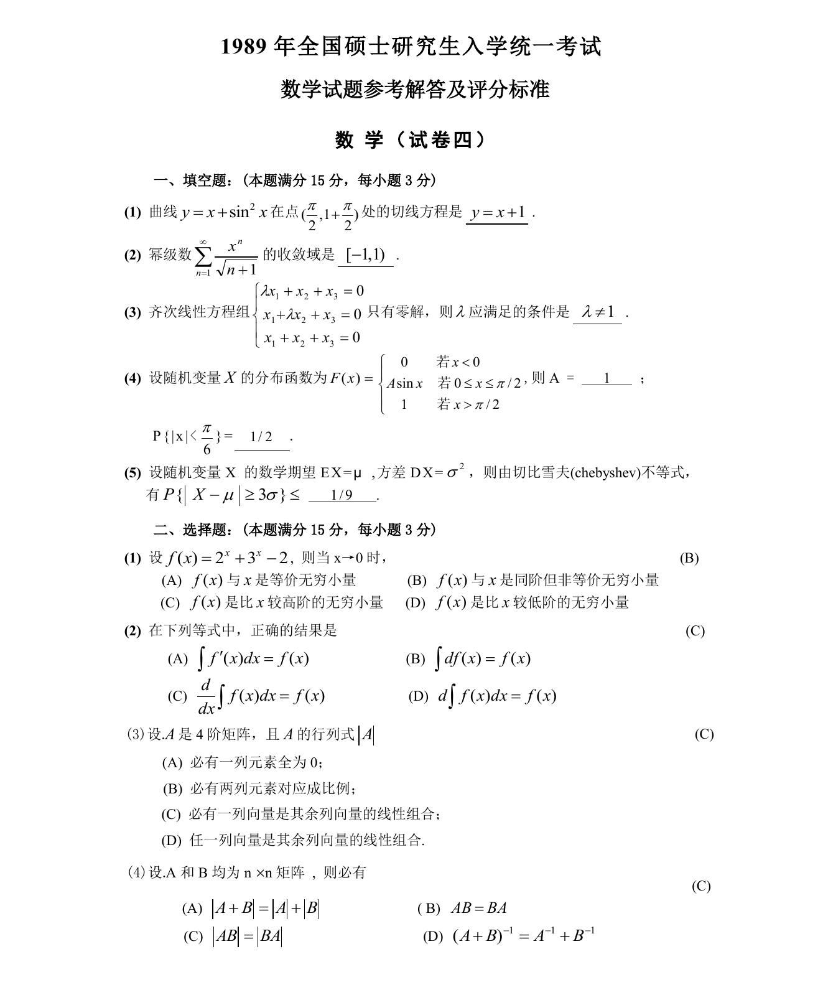

# 1989 数学三第 6 题

## 题目

设$f(x)=2^x+3^x-2$，则当$x\to 0$时 （ ）

A. $f(x)$与$x$是等价无穷小量．

B. $f(x)$与$x$是同阶但非等价无穷小量．

C. $f(x)$是比$x$较高阶的无穷小量．

D. $f(x)$是比$x$较低阶的无穷小量．

## 标准答案

B

## 解析

答案为 B。解析见下方答案解析页图；PDF 文本层公式不稳定，未直接转写为 LaTeX。

## 答案解析页图

## 来源

- 题目来源：1989 年数学三 TeX 试卷源（试卷四）。
- 答案解析来源：1989数学三真题答案解析（试卷四）.pdf。
- 页面图只作为原卷/解析复核依据；题干正文已按 TeX 源整理为 LaTeX。
