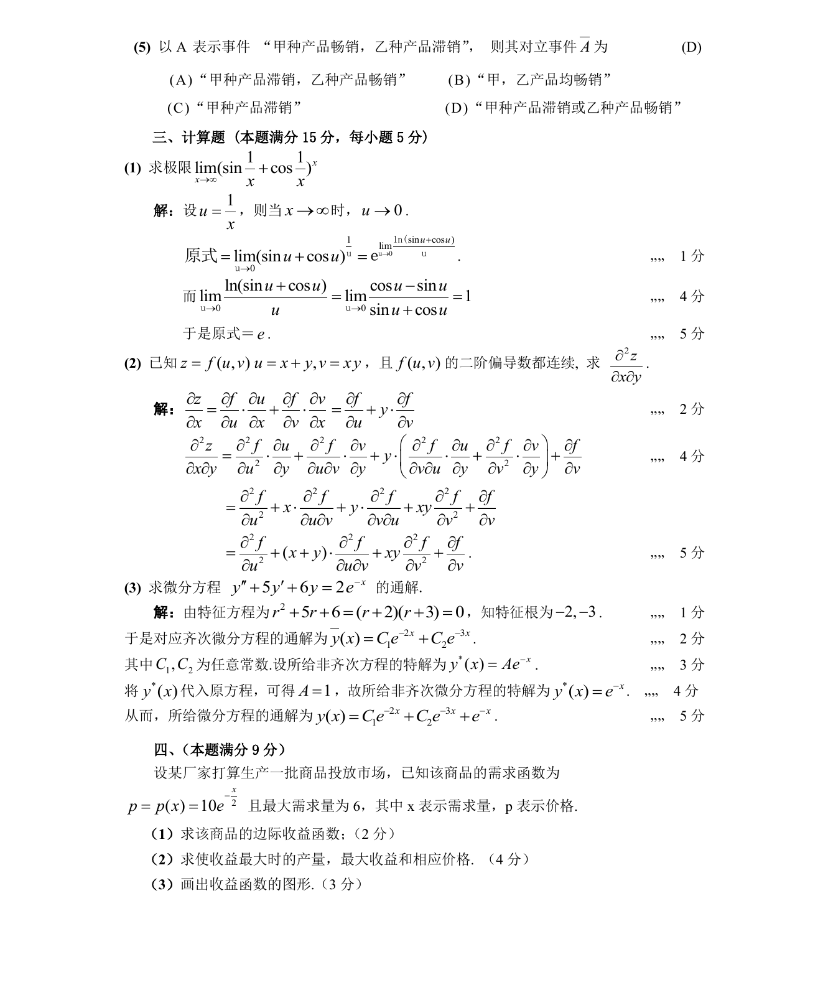

# 1989 数学三第 10 题

## 题目

以$A$表示事件“甲种产品畅销，乙种产品滞销”，则其对立事件$\overline{A}$为 （ ）

A. “甲种产品滞销，乙种产品畅销”．

B. “甲、乙两种产品均畅销”．

C. “甲种产品滞销”．

D. “甲种产品滞销或乙种产品畅销”．

## 标准答案

D

## 解析

答案为 D。解析见下方答案解析页图；PDF 文本层公式不稳定，未直接转写为 LaTeX。

## 答案解析页图

## 来源

- 题目来源：1989 年数学三 TeX 试卷源（试卷四）。
- 答案解析来源：1989数学三真题答案解析（试卷四）.pdf。
- 页面图只作为原卷/解析复核依据；题干正文已按 TeX 源整理为 LaTeX。
