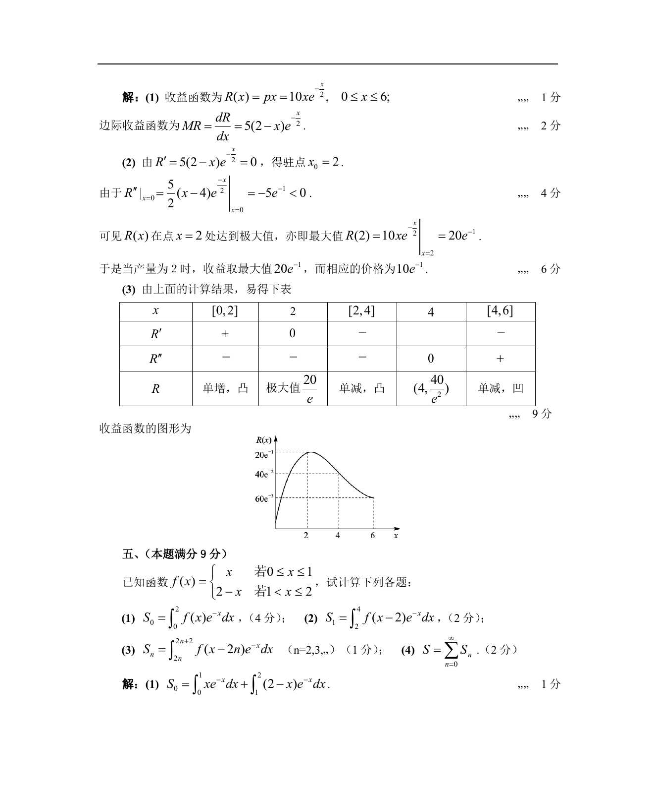

# 1989 数学三第 15 题

## 题目

已知函数$f(x)=\begin{cases}
x, & 0\le x\le 1, \\
2-x, & 1\le x\le 2. \\
\end{cases}$ 试计算下列各题：

1. $S_0=\int_0^2f(x)\mathrm{e}^{-x}\,\mathrm{d}x$；
2. $S_1=\int_2^4f(x-2)\mathrm{e}^{-x}\,\mathrm{d}x$；\\
3. $S_n=\int_{2n}^{2n+2}f(x-2n)\mathrm{e}^{-x}\,\mathrm{d}x(n=2,3,\cdots)$；
4. $S=\sum_{n=0}^{\infty}S_n$．

## 标准答案

见答案解析页图

## 解析

解析见下方答案解析页图；PDF 文本层公式不稳定，未直接转写为 LaTeX。

## 答案解析页图

## 来源

- 题目来源：1989 年数学三 TeX 试卷源（试卷四）。
- 答案解析来源：1989数学三真题答案解析（试卷四）.pdf。
- 页面图只作为原卷/解析复核依据；题干正文已按 TeX 源整理为 LaTeX。
