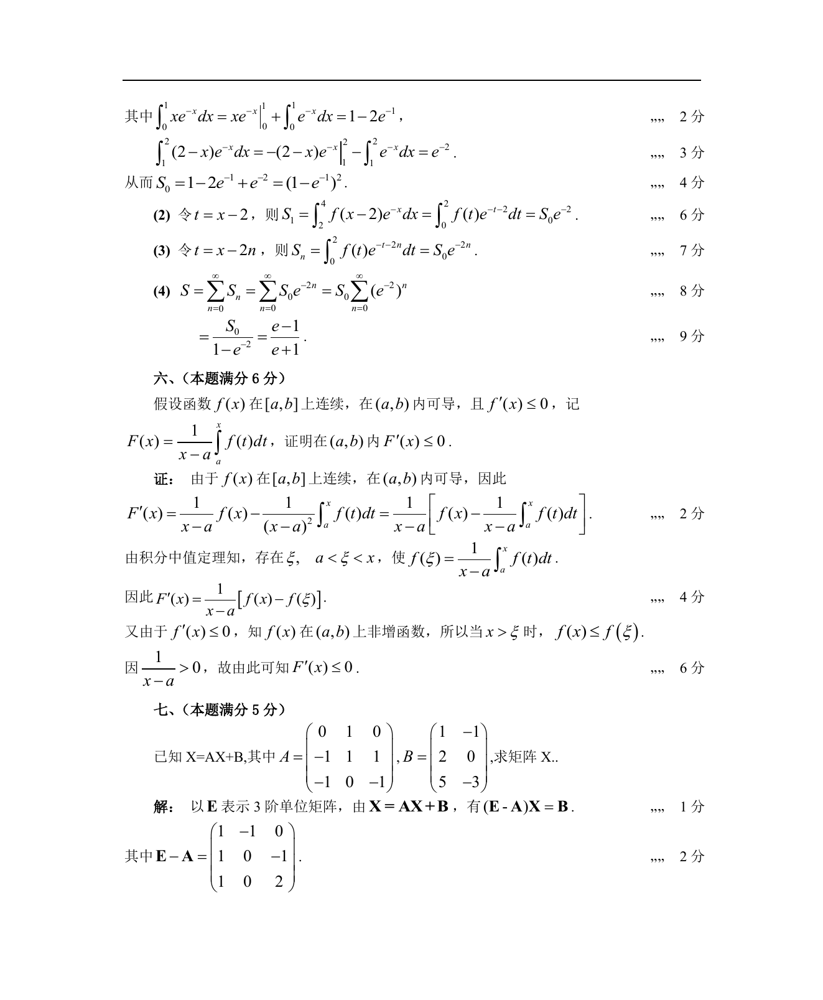

# 1989 数学三第 16 题

## 题目

假设函数$f(x)$在$[a,b]$上连续，在$(a,b)$内可导，且$f'(x)\le 0$，记
$$F(x)=\frac{1}{x-a}\int_a^x f(t)\,\mathrm{d}t,$$
证明在$(a,b)$内，$F'(x)\le 0$．

## 标准答案

见答案解析页图

## 解析

解析见下方答案解析页图；PDF 文本层公式不稳定，未直接转写为 LaTeX。

## 答案解析页图

## 来源

- 题目来源：1989 年数学三 TeX 试卷源（试卷四）。
- 答案解析来源：1989数学三真题答案解析（试卷四）.pdf。
- 页面图只作为原卷/解析复核依据；题干正文已按 TeX 源整理为 LaTeX。
