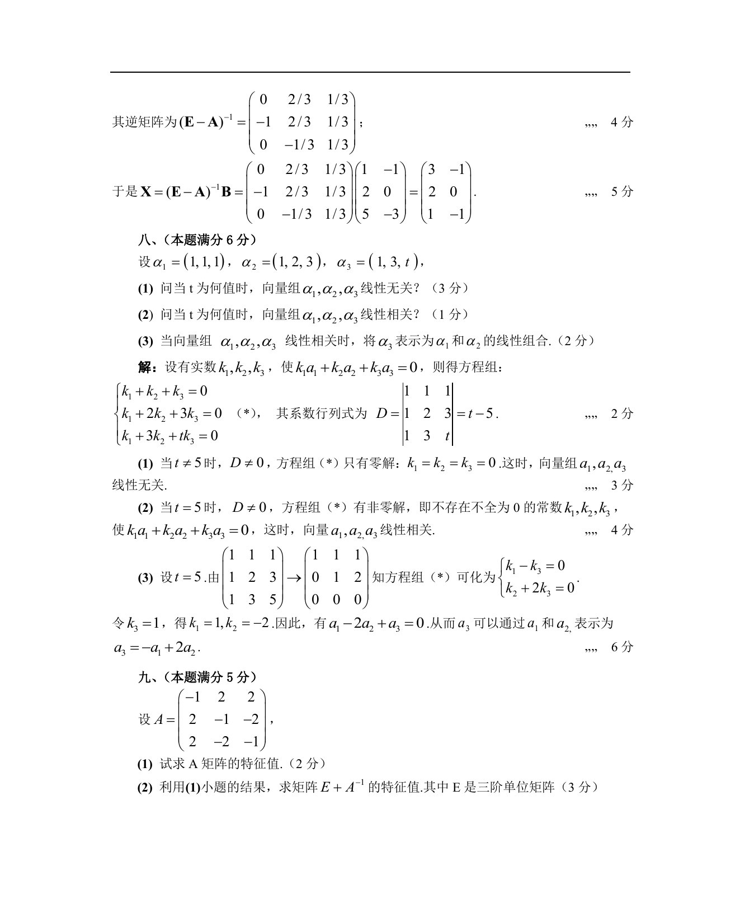

# 1989 数学三第 18 题

## 题目

设$\alpha_1=(1,1,1)$, $\alpha_2=(1,2,3)$, $\alpha_3=(1,3,t)$．

1. 问当$t$为何值时，向量组$\alpha_1,\alpha_2,\alpha_3$线性无关？
2. 问当$t$为何值时，向量组$\alpha_1,\alpha_2,\alpha_3$线性相关？
3. 当向量组$\alpha_1,\alpha_2,\alpha_3$线性相关时，
将$\alpha_3$表示为$\alpha_1$和$\alpha_2$的线性组合．

## 标准答案

见答案解析页图

## 解析

解析见下方答案解析页图；PDF 文本层公式不稳定，未直接转写为 LaTeX。

## 答案解析页图

## 来源

- 题目来源：1989 年数学三 TeX 试卷源（试卷四）。
- 答案解析来源：1989数学三真题答案解析（试卷四）.pdf。
- 页面图只作为原卷/解析复核依据；题干正文已按 TeX 源整理为 LaTeX。
