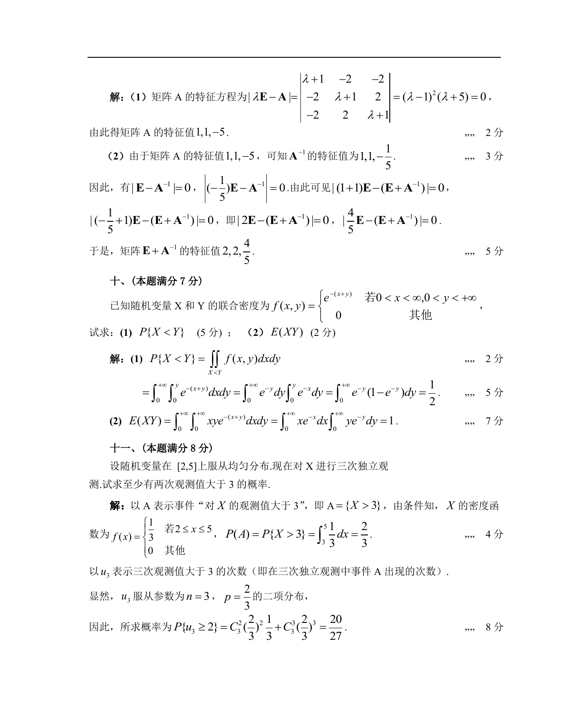

# 1989 数学三第 20 题

## 题目

已知随机变量$X$和$Y$的联合密度为
$$f(x,y)=\begin{cases}
\mathrm{e}^{-(x+y)}, & 0<x<+\infty, 0<y<+\infty, \\
0, & 其他. \\
\end{cases}$$
试求：

1. $P\{X<Y\}$；
2. $E(XY)$．

## 标准答案

见答案解析页图

## 解析

解析见下方答案解析页图；PDF 文本层公式不稳定，未直接转写为 LaTeX。

## 答案解析页图

## 来源

- 题目来源：1989 年数学三 TeX 试卷源（试卷四）。
- 答案解析来源：1989数学三真题答案解析（试卷四）.pdf。
- 页面图只作为原卷/解析复核依据；题干正文已按 TeX 源整理为 LaTeX。
