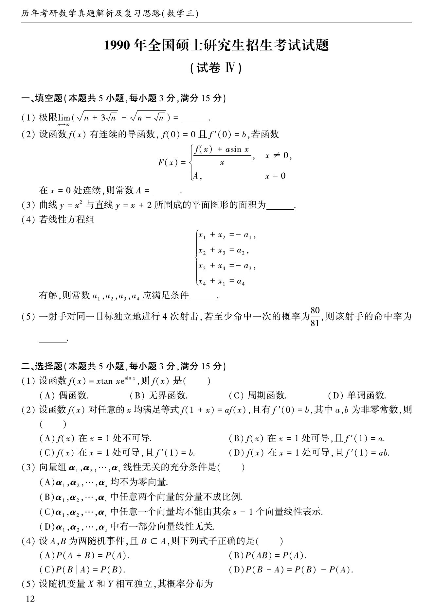
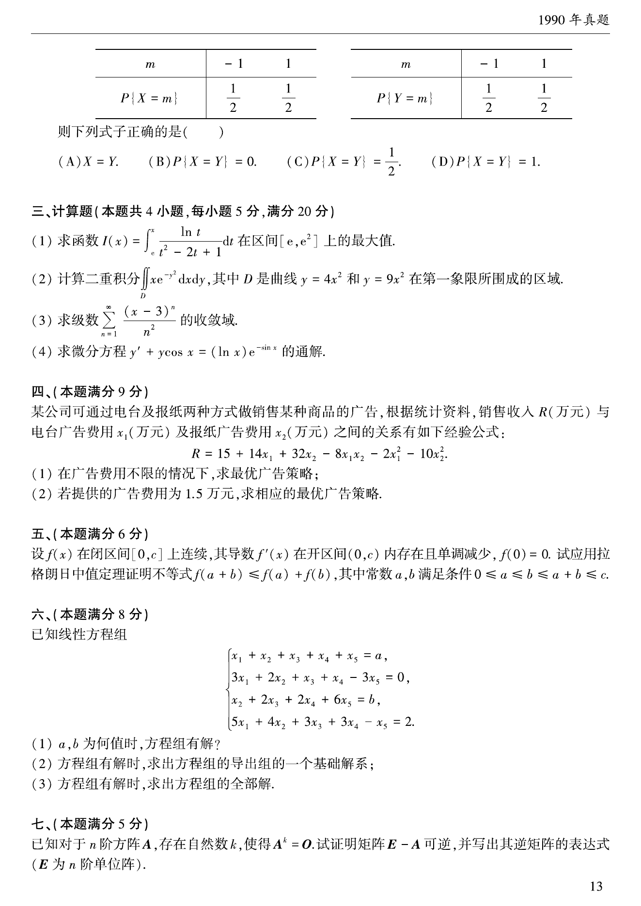
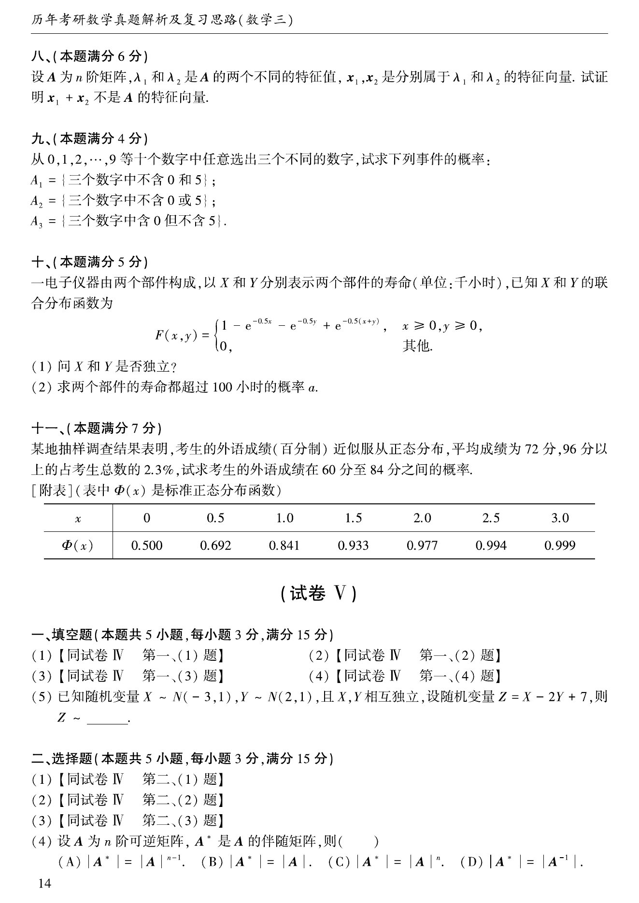
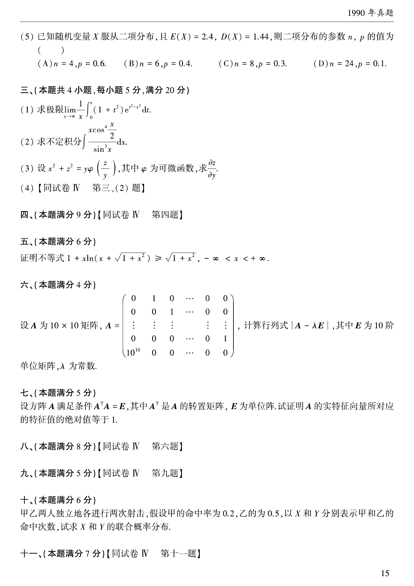

# 1990 年考研数学三真题

资料类型：考研数学三历年真题
年份：1990
科目：数学三
整理状态：TeX 题干源整理，答案解析 PDF 文本层拆分

## 原卷页图

## 填空题（本题满分15分，每小题3分）

### 第 1 题

- 题型：填空题
- 题号：1
- 分值：3
- 模块：高等数学
- 校对状态：已按 TeX 源整理

极限$\lim_{n\to\infty}\,\left(\sqrt{n+3\sqrt{n}}-\sqrt{n-\sqrt{n}}\right)=$____.

### 第 2 题

- 题型：填空题
- 题号：2
- 分值：3
- 模块：高等数学
- 校对状态：已按 TeX 源整理

设函数$f(x)$有连续的导函数，$f(0)=0,f'(0)=b$，若函数
$$F(x)=\begin{cases}
\frac{f(x)+a\sin x}{x}, & x\ne 0, \\
A, & x=0
\end{cases}$$
在$x=0$处连续，则常数$A$=____.

### 第 3 题

- 题型：填空题
- 题号：3
- 分值：3
- 模块：高等数学
- 校对状态：已按 TeX 源整理

曲线$y=x^2$与直线$y=x+2$所围成的平面图形的面积为____.

### 第 4 题

- 题型：填空题
- 题号：4
- 分值：3
- 模块：线性代数
- 校对状态：已按 TeX 源整理

若线性方程组$\begin{cases}
x_1+x_2=-a_1, \\
x_2+x_3=a_2, \\
x_3+x_4=-a_3, \\
x_4+x_1=a_4 \\
\end{cases}$有解，则常数$a_1$, $a_2$, $a_3$, $a_4$应满足条件____.

### 第 5 题

- 题型：填空题
- 题号：5
- 分值：3
- 模块：概率统计
- 校对状态：已按 TeX 源整理

一射手对同一目标独立地进行四次射击，若至少命中一次的概率为$\frac{80}{81}$,
则该射手的命中率为____.

## 选择题（本题满分15分，每小题3分）

### 第 6 题

- 题型：选择题
- 题号：6
- 分值：3
- 模块：高等数学
- 校对状态：已按 TeX 源整理

设函数$f(x)=x\cdot \tan x\cdot \mathrm{e}^{\sin x}$，则$f(x)$是（ ）

A. 偶函数．

B. 无界函数．

C. 周期函数．

D. 单调函数．

### 第 7 题

- 题型：选择题
- 题号：7
- 分值：3
- 模块：高等数学
- 校对状态：已按 TeX 源整理

设函数$f(x)$对任意$x$均满足等式$f(1+x)=af(x)$，且有$f'(0)=b$,
其中$a$, $b$为非零常数，则（ ）

A. $f(x)$在$x=1$处不可导．

B. $f(x)$在$x=1$处可导，且$f'(1)=a$．

C. $f(x)$在$x=1$处可导，且$f'(1)=b$．

D. $f(x)$在$x=1$处可导，且$f'(1)=ab$．

### 第 8 题

- 题型：选择题
- 题号：8
- 分值：3
- 模块：线性代数
- 校对状态：已按 TeX 源整理

向量组$\alpha_1,\alpha_2,\cdots,\alpha_s$线性无关的充分条件是（ ）

A. $\alpha_1,\alpha_2,\cdots,\alpha_s$均不为零向量．

B. $\alpha_1,\alpha_2,\cdots,\alpha_s$中任意两个向量的分量不成比例．

C. $\alpha_1,\alpha_2,\cdots,\alpha_s$中任意一个向量均不能由其余$s-1$个向量线性表示．

D. $\alpha_1,\alpha_2,\cdots,\alpha_s$中有一部分向量线性无关．

### 第 9 题

- 题型：选择题
- 题号：9
- 分值：3
- 模块：高等数学
- 校对状态：已按 TeX 源整理

设$A,B$为两随机事件，且$B\subset A$，则下列式子正确的是（ ）

A. $P(A+B)=P(A)$．

B. $P(AB)=P(A)$．

C. $P(B|A)=P(B)$．

D. $P(B-A)=P(B)-P(A)$．

### 第 10 题

- 题型：选择题
- 题号：10
- 分值：3
- 模块：概率统计
- 校对状态：已按 TeX 源整理

设随机变量$X$和$Y$相互独立，其概率分布为
$$\begin{array}{|c|cc|}
\hline
m & -1 & 1 \\
\hline
P\{X=m\} & 1/2 & 1/2\\
\hline
\end{array}

\begin{array}{|c|cc|}
\hline
m & -1 & 1 \\
\hline
P\{Y=m\} & 1/2 & 1/2 \\
\hline
\end{array}$$
则下列式子正确的是（ ）

A. $X=Y$．

B. $P\{X=Y\}=0$．

C. $P\{X=Y\}=\frac{1}{2}$．

D. $P\{X=Y\}=1$．

## 计算题（本题满分20分，每小题5分）

### 第 11 题

- 题型：解答题
- 题号：11
- 分值：5
- 模块：高等数学
- 校对状态：已按 TeX 源整理

求函数$I(x)=\int_{\mathrm{e}}^x \frac{\ln t}{t^2-2t+1}\,\mathrm{d}t$在区间$[\mathrm{e}, \mathrm{e}^2]$上的最大值．

### 第 12 题

- 题型：解答题
- 题号：12
- 分值：5
- 模块：高等数学
- 校对状态：已按 TeX 源整理

计算二重积分$\iint_D x\mathrm{e}^{-y^2}\,\mathrm{d}x\,\mathrm{d}y$，其中$D$是曲线$y=4x^2$和$y=9x^2$在第一象限所围成的区域．

### 第 13 题

- 题型：解答题
- 题号：13
- 分值：5
- 模块：高等数学
- 校对状态：已按 TeX 源整理

求级数$\sum_{n=1}^{\infty}\frac{(x-3)^n}{n^2}$的收敛域．

### 第 14 题

- 题型：解答题
- 题号：14
- 分值：5
- 模块：高等数学
- 校对状态：已按 TeX 源整理

求微分方程$y'+y\cos x=(\ln x)\mathrm{e}^{-\sin x}$的通解．

## 第 4 部分（本题满分9分）

### 第 15 题

- 题型：解答题
- 题号：15
- 分值：9
- 模块：高等数学
- 校对状态：已按 TeX 源整理

某公司可通过电台及报纸两种形式做销售某种商品的广告，根据统计资料，
销售收入$R$(万元)与电台广告费用$x_1$(万元)及报纸广告费用$x_2$(万元)之间的关系有如下经验公式:
$$R=15+14x_1+32x_2-8x_1x_2-2x_1^2-10x_2^2.$$

1. 在广告费用不限的情况下，求最优广告策略；
2. 若提供的广告费用为$1.5$万元，求相应的最优广告策略．

## 第 5 部分（本题满分6分）

### 第 16 题

- 题型：解答题
- 题号：16
- 分值：6
- 模块：高等数学
- 校对状态：已按 TeX 源整理

设$f(x)$在闭区间$[0,c]$上连续，其导数$f'(x)$在开区间$(0,c)$内存在且单调减少；$f(0)=0$，
试应用拉格朗日中值定理证明不等式：$f(a+b)\le f(a)+f(b)$，其中常数$ab$满足条件$0\le a\le b\le a+b\le c$．

## 第 6 部分（本题满分8分）

### 第 17 题

- 题型：解答题
- 题号：17
- 分值：8
- 模块：线性代数
- 校对状态：已按 TeX 源整理

已知线性方程组$\begin{cases}
x_1+x_2+x_3+x_4+x_5=a, \\
3x_1+2x_2+x_3+x_4-3x_5=0, \\
x_2+2x_3+2x_4+6x_5=b, \\
5x_1+4x_2+3x_3+3x_4-x_5=2,
\end{cases}$

1. $a$, $b$为何值时，方程组有解？
2. 方程组有解时，求出方程组的导出组的一个基础解系；
3. 方程组有解时，求出方程组的全部解．

## 第 7 部分（本题满分5分）

### 第 18 题

- 题型：解答题
- 题号：18
- 分值：5
- 模块：线性代数
- 校对状态：已按 TeX 源整理

已知对于$n$阶方阵$A$，存在自然数$k$，使得$A^k=0$，试证明矩阵$E-A$可逆，
并写出其逆矩阵的表达式($E$为$n$阶单位阵).

## 第 8 部分（本题满分6分）

### 第 19 题

- 题型：解答题
- 题号：19
- 分值：6
- 模块：线性代数
- 校对状态：已按 TeX 源整理

设$A$是$n$阶矩阵，$\lambda_1$和$\lambda_2$是$A$的两个不同的特征值，
$x_1,x_2$是分别属于$\lambda_1$和$\lambda_2$的特征向量．
试证明$x_1+x_2$不是$A$的特征向量．

## 第 9 部分（本题满分4分）

### 第 20 题

- 题型：解答题
- 题号：20
- 分值：4
- 模块：概率统计
- 校对状态：已按 TeX 源整理

从$0,1,2,\cdots,9$十个数字中任意选出三个不同数字，试求下列事件的概率：

$A_1=$\{三个数字中不含$0$和$5$\}； $A_2=$\{三个数字中不含$0$或$5$\}.

## 第 10 部分（本题满分5分）

### 第 21 题

- 题型：解答题
- 题号：21
- 分值：5
- 模块：概率统计
- 校对状态：已按 TeX 源整理

一电子仪器由两个部件构成，以$X$和$Y$分别表示两个部件的寿命（单位：千小时），
已知$X$和$Y$的联合分布函数为：
$$F(x,y)=\begin{cases}
1-\mathrm{e}^{-0.5x}-\mathrm{e}^{-0.5y}+\mathrm{e}^{-0.5(x+y)}, & x\ge 0, y\ge 0, \\
0, & 其他. \\
\end{cases}$$

1. 问$X$和$Y$是否独立？
2. 求两个部件的寿命都超过100小时的概率$\alpha$．

## 第 11 部分（本题满分7分）

### 第 22 题

- 题型：解答题
- 题号：22
- 分值：7
- 模块：概率统计
- 校对状态：已按 TeX 源整理

某地抽样调查结果表明，考生的外语成绩(百分制)近似服从正态分布，平均成绩为72分，96分以上的占考生总数的2.3\%,
试求考生的外语成绩在60分至84分之间的概率．

\centerline{[附表]（表中$\Phi (x)$是标准正态分布函数．）}
$$\begin{array}{|c|ccccccc|}
\hline
x & 0 & 0.5 & 1.0 & 1.5 & 2.0 & 2.5 & 3.0 \\
\hline
\Phi(x) & 0.500 & 0.692 & 0.841 & 0.933 & 0.977 & 0.994 & 0.999 \\
\hline
\end{array}$$
