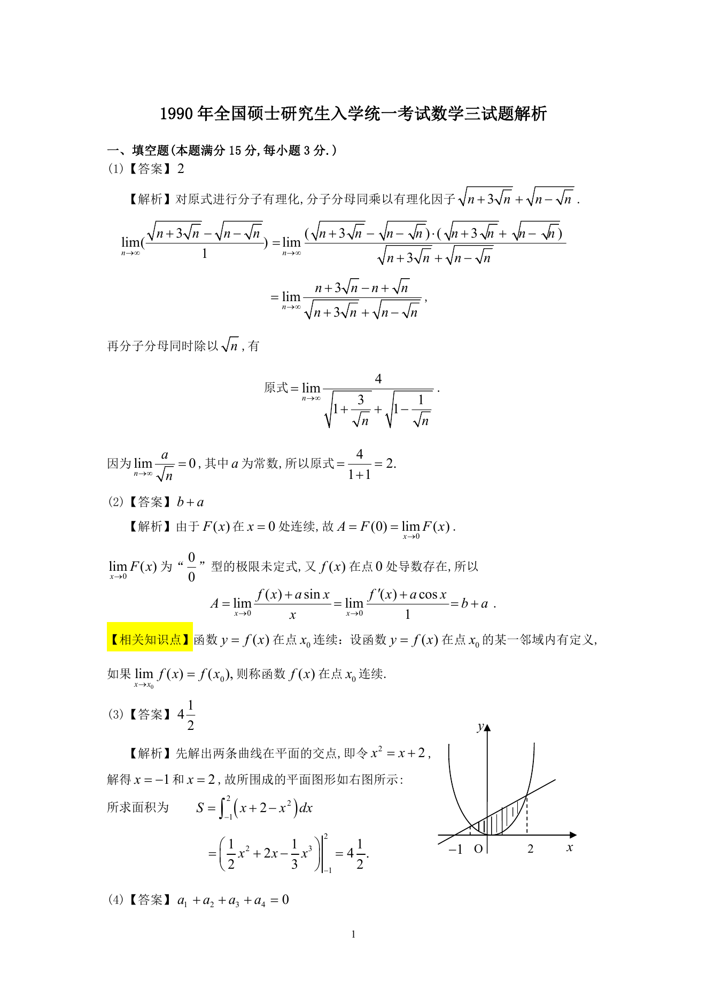

# 1990 数学三第 1 题

## 题目

极限$\lim_{n\to\infty}\,\left(\sqrt{n+3\sqrt{n}}-\sqrt{n-\sqrt{n}}\right)=$\underline{\qquad}.

## 标准答案

2

## 解析

答案为 2。解析见下方答案解析页图；PDF 文本层公式不稳定，未直接转写为 LaTeX。

## 答案解析页图

## 来源

- 题目来源：1990 年数学三 TeX 试卷源（试卷四）。
- 答案解析来源：1990年数学三真题答案解析.pdf。
- 页面图只作为原卷/解析复核依据；题干正文已按 TeX 源整理为 LaTeX。
