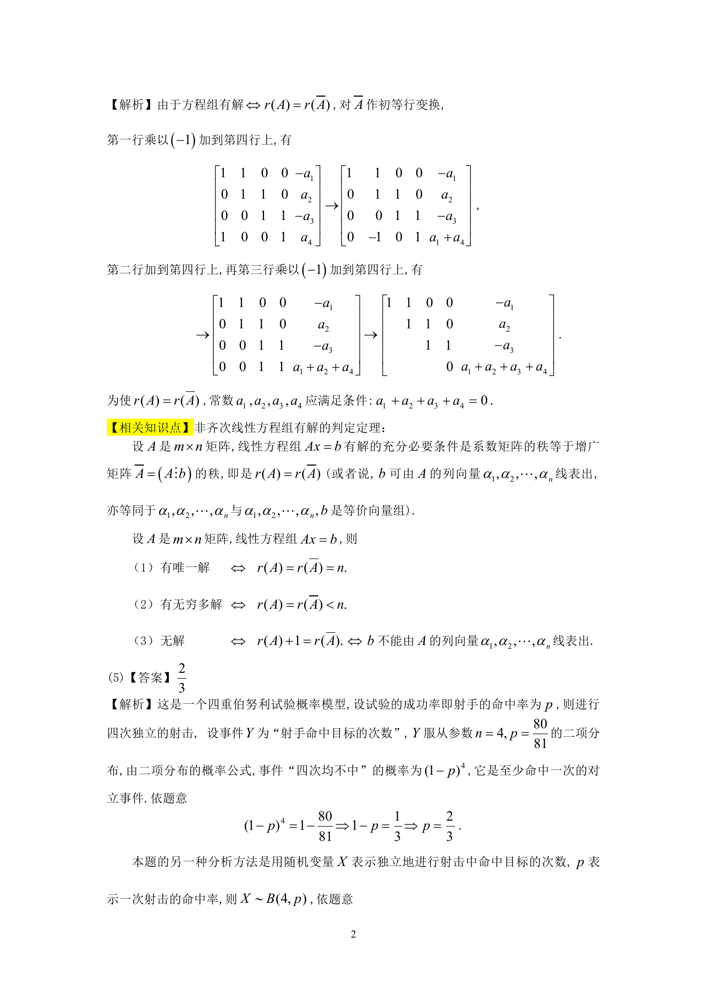

# 1990 数学三第 4 题

## 题目

若线性方程组$\begin{cases}
x_1+x_2=-a_1, \\
x_2+x_3=a_2, \\
x_3+x_4=-a_3, \\
x_4+x_1=a_4 \\
\end{cases}$有解，则常数$a_1$, $a_2$, $a_3$, $a_4$应满足条件\underline{\qquad}.

## 标准答案

见答案解析页图

## 解析

该题答案见下方答案解析页图；PDF 文本层顺序和公式不稳定，未直接转写为标准 LaTeX 文本。

## 答案解析页图

## 来源

- 题目来源：1990 年数学三 TeX 试卷源（试卷四）。
- 答案解析来源：1990年数学三真题答案解析.pdf。
- 页面图只作为原卷/解析复核依据；题干正文已按 TeX 源整理为 LaTeX。
