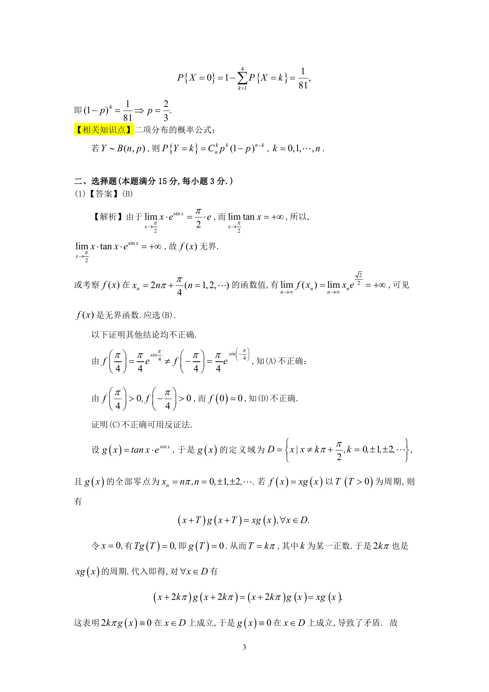
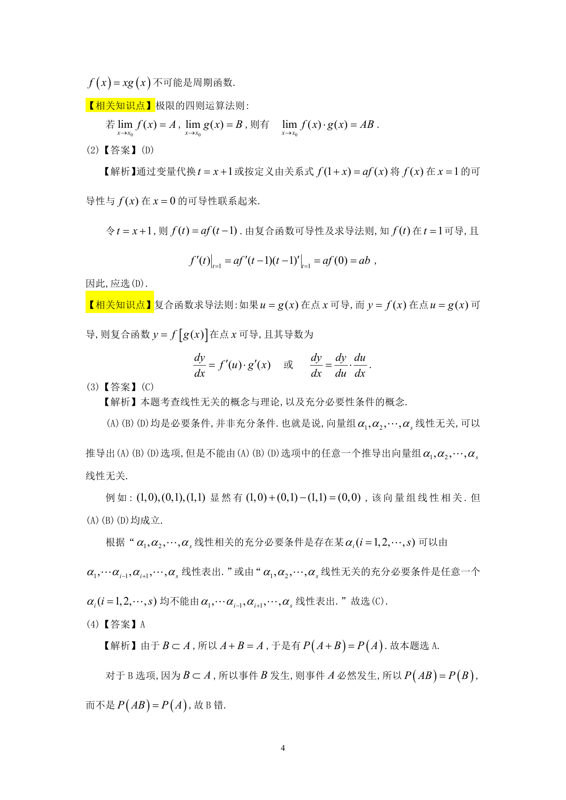

# 1990 数学三第 7 题

## 题目

设函数$f(x)$对任意$x$均满足等式$f(1+x)=af(x)$，且有$f'(0)=b$,
其中$a$, $b$为非零常数，则（ ）

A. $f(x)$在$x=1$处不可导．

B. $f(x)$在$x=1$处可导，且$f'(1)=a$．

C. $f(x)$在$x=1$处可导，且$f'(1)=b$．

D. $f(x)$在$x=1$处可导，且$f'(1)=ab$．

## 标准答案

D

## 解析

答案为 D。解析见下方答案解析页图；PDF 文本层公式不稳定，未直接转写为 LaTeX。

## 答案解析页图

## 来源

- 题目来源：1990 年数学三 TeX 试卷源（试卷四）。
- 答案解析来源：1990年数学三真题答案解析.pdf。
- 页面图只作为原卷/解析复核依据；题干正文已按 TeX 源整理为 LaTeX。
