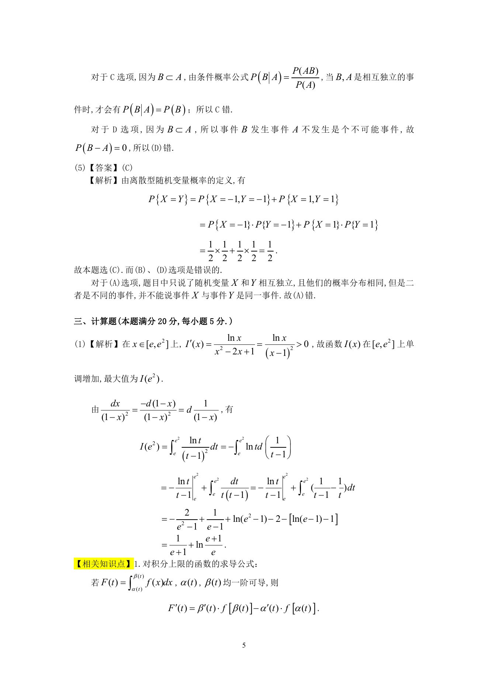
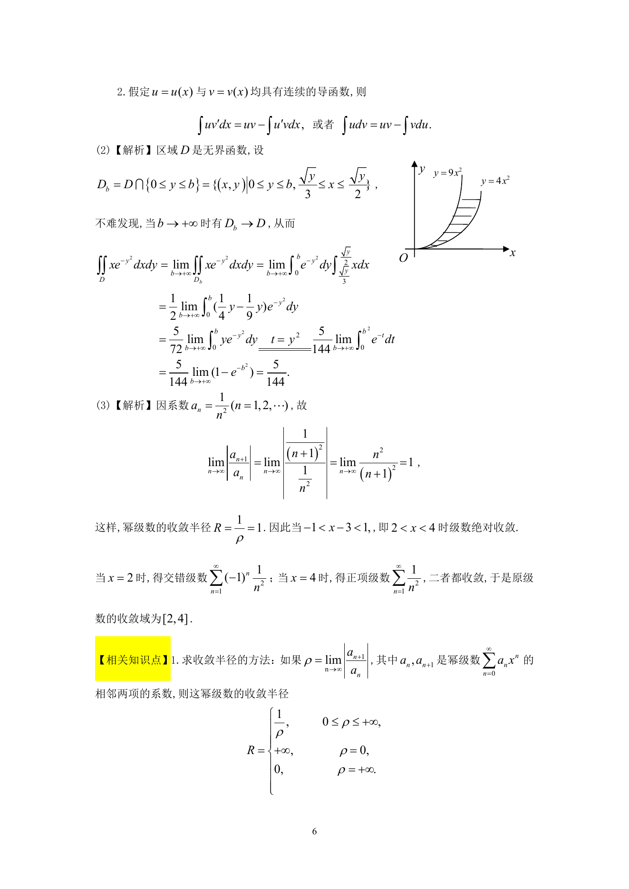

# 1990 数学三第 11 题

## 题目

求函数$I(x)=\int_{\mathrm{e}}^x \frac{\ln t}{t^2-2t+1}\,\mathrm{d}t$在区间$[\mathrm{e}, \mathrm{e}^2]$上的最大值．

## 标准答案

见答案解析页图

## 解析

解析见下方答案解析页图；PDF 文本层公式不稳定，未直接转写为 LaTeX。

## 答案解析页图

## 来源

- 题目来源：1990 年数学三 TeX 试卷源（试卷四）。
- 答案解析来源：1990年数学三真题答案解析.pdf。
- 页面图只作为原卷/解析复核依据；题干正文已按 TeX 源整理为 LaTeX。
