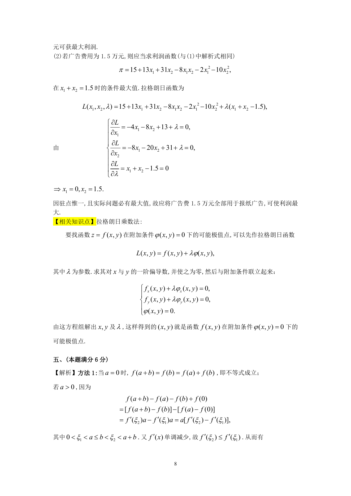

# 1990 数学三第 15 题

## 题目

某公司可通过电台及报纸两种形式做销售某种商品的广告，根据统计资料，
销售收入$R$(万元)与电台广告费用$x_1$(万元)及报纸广告费用$x_2$(万元)之间的关系有如下经验公式:
$$R=15+14x_1+32x_2-8x_1x_2-2x_1^2-10x_2^2.$$

1. 在广告费用不限的情况下，求最优广告策略；
2. 若提供的广告费用为$1.5$万元，求相应的最优广告策略．

## 标准答案

见答案解析页图

## 解析

解析见下方答案解析页图；PDF 文本层公式不稳定，未直接转写为 LaTeX。

## 答案解析页图

## 来源

- 题目来源：1990 年数学三 TeX 试卷源（试卷四）。
- 答案解析来源：1990年数学三真题答案解析.pdf。
- 页面图只作为原卷/解析复核依据；题干正文已按 TeX 源整理为 LaTeX。
