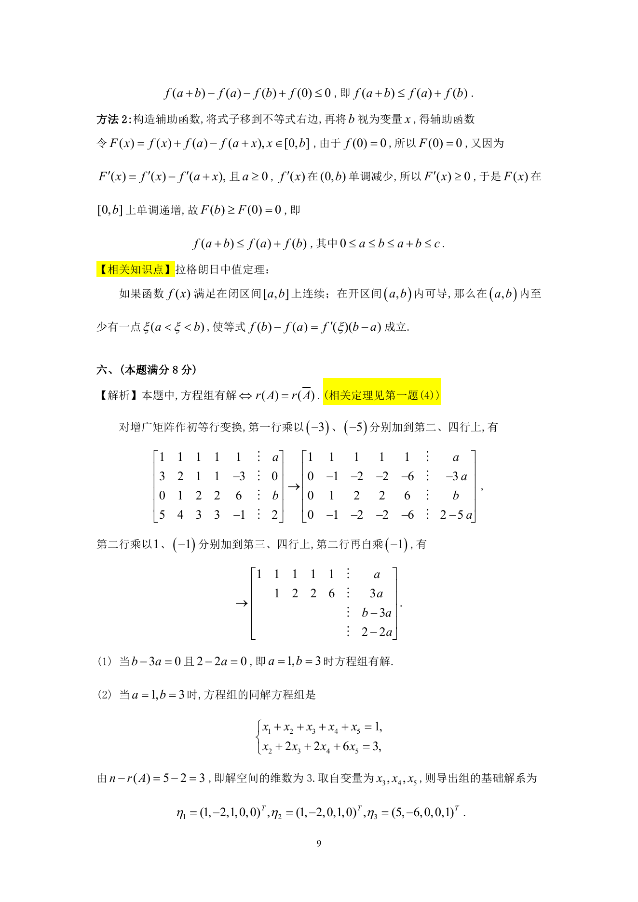

# 1990 数学三第 17 题

## 题目

已知线性方程组$\begin{cases}
x_1+x_2+x_3+x_4+x_5=a, \\
3x_1+2x_2+x_3+x_4-3x_5=0, \\
x_2+2x_3+2x_4+6x_5=b, \\
5x_1+4x_2+3x_3+3x_4-x_5=2,
\end{cases}$

1. $a$, $b$为何值时，方程组有解？
2. 方程组有解时，求出方程组的导出组的一个基础解系；
3. 方程组有解时，求出方程组的全部解．

## 标准答案

见答案解析页图

## 解析

解析见下方答案解析页图；PDF 文本层公式不稳定，未直接转写为 LaTeX。

## 答案解析页图

## 来源

- 题目来源：1990 年数学三 TeX 试卷源（试卷四）。
- 答案解析来源：1990年数学三真题答案解析.pdf。
- 页面图只作为原卷/解析复核依据；题干正文已按 TeX 源整理为 LaTeX。
