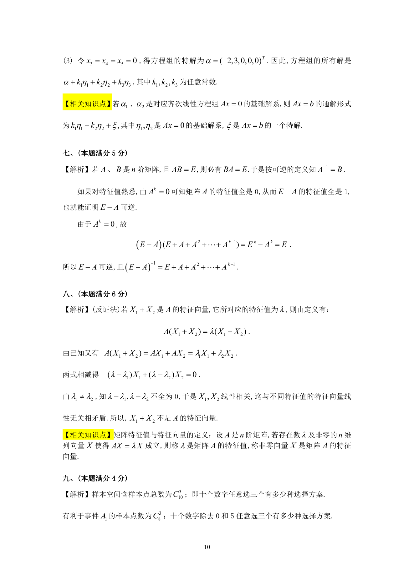

# 1990 数学三第 19 题

## 题目

设$A$是$n$阶矩阵，$\lambda_1$和$\lambda_2$是$A$的两个不同的特征值，
$x_1,x_2$是分别属于$\lambda_1$和$\lambda_2$的特征向量．
试证明$x_1+x_2$不是$A$的特征向量．

## 标准答案

见答案解析页图

## 解析

解析见下方答案解析页图；PDF 文本层公式不稳定，未直接转写为 LaTeX。

## 答案解析页图

## 来源

- 题目来源：1990 年数学三 TeX 试卷源（试卷四）。
- 答案解析来源：1990年数学三真题答案解析.pdf。
- 页面图只作为原卷/解析复核依据；题干正文已按 TeX 源整理为 LaTeX。
