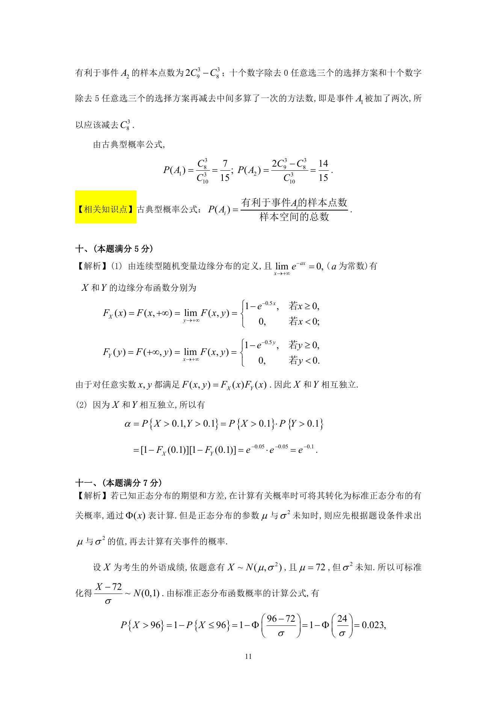

# 1990 数学三第 20 题

## 题目

从$0,1,2,\cdots,9$十个数字中任意选出三个不同数字，试求下列事件的概率：

$A_1=$\{三个数字中不含$0$和$5$\}； $A_2=$\{三个数字中不含$0$或$5$\}.

## 标准答案

见答案解析页图

## 解析

解析见下方答案解析页图；PDF 文本层公式不稳定，未直接转写为 LaTeX。

## 答案解析页图

## 来源

- 题目来源：1990 年数学三 TeX 试卷源（试卷四）。
- 答案解析来源：1990年数学三真题答案解析.pdf。
- 页面图只作为原卷/解析复核依据；题干正文已按 TeX 源整理为 LaTeX。
