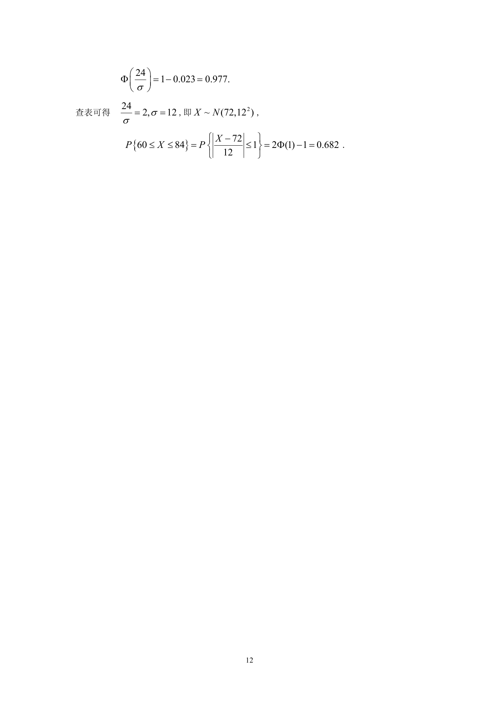

# 1990 数学三第 22 题

## 题目

某地抽样调查结果表明，考生的外语成绩(百分制)近似服从正态分布，平均成绩为72分，96分以上的占考生总数的2.3\%,
试求考生的外语成绩在60分至84分之间的概率．

\centerline{[附表]（表中$\Phi (x)$是标准正态分布函数．）}
$$\begin{array}{|c|ccccccc|}
\hline
x & 0 & 0.5 & 1.0 & 1.5 & 2.0 & 2.5 & 3.0 \\
\hline
\Phi(x) & 0.500 & 0.692 & 0.841 & 0.933 & 0.977 & 0.994 & 0.999 \\
\hline
\end{array}$$

## 标准答案

见答案解析页图

## 解析

解析见下方答案解析页图；PDF 文本层公式不稳定，未直接转写为 LaTeX。

## 答案解析页图

## 来源

- 题目来源：1990 年数学三 TeX 试卷源（试卷四）。
- 答案解析来源：1990年数学三真题答案解析.pdf。
- 页面图只作为原卷/解析复核依据；题干正文已按 TeX 源整理为 LaTeX。
