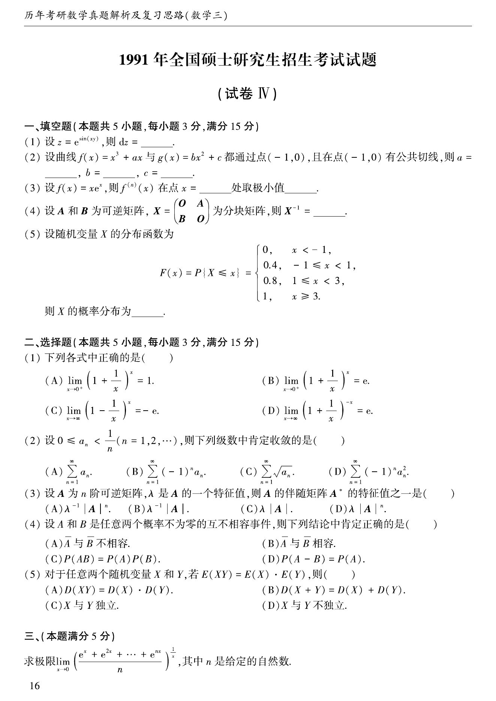
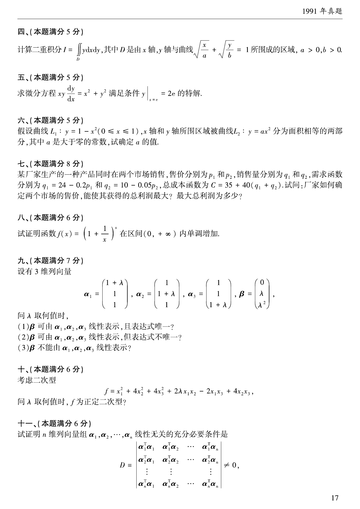
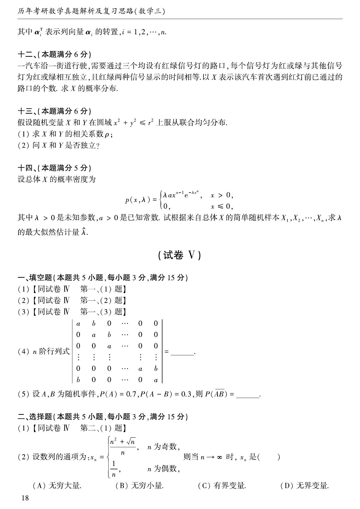
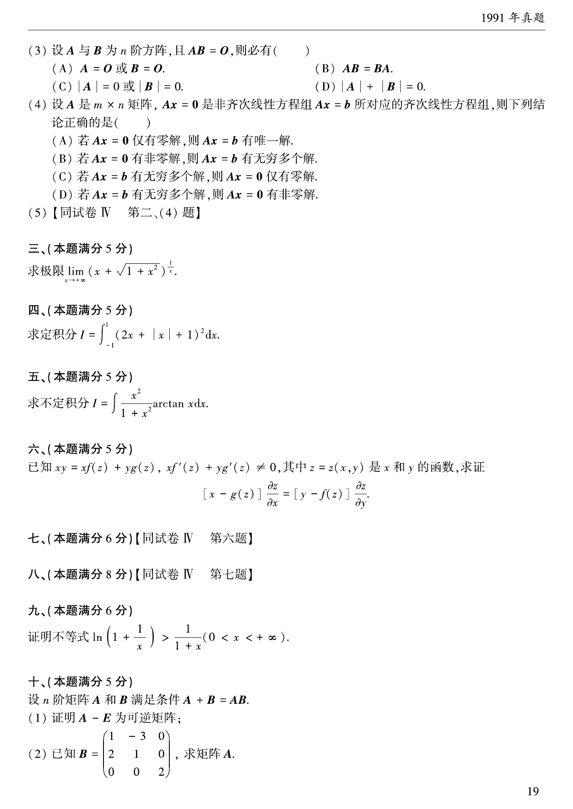

# 1991 年考研数学三真题

资料类型：考研数学三历年真题
年份：1991
科目：数学三
整理状态：TeX 题干源整理，答案解析 PDF 文本层拆分

## 原卷页图

## 填空题（本题满分15分，每小题3分）

### 第 1 题

- 题型：填空题
- 题号：1
- 分值：3
- 模块：高等数学
- 校对状态：已按 TeX 源整理

设$z = \mathrm{e}^{\sin(xy)}$，则$\,\mathrm{d}z=$ ____.

### 第 2 题

- 题型：填空题
- 题号：2
- 分值：3
- 模块：高等数学
- 校对状态：已按 TeX 源整理

设曲线$f(x) = x^3 + ax$与$g(x) = bx^2 + c$都通过点$(-1,0)$，
且在点$(-1,0)$有公共切线，则$a =$ ____, $b =$____, $c =$ ____.

### 第 3 题

- 题型：填空题
- 题号：3
- 分值：3
- 模块：高等数学
- 校对状态：已按 TeX 源整理

设$f(x) = x\mathrm{e}^x$，则$f^{(n)}(x)$在点$x=$ ____处取极小值____ .

### 第 4 题

- 题型：填空题
- 题号：4
- 分值：3
- 模块：线性代数
- 校对状态：已按 TeX 源整理

设$A$和$B$为可逆矩阵，$X = \begin{pmatrix}
0 & A \\
B & 0
\end{pmatrix}$为分块矩阵，则$X^{-1} =$ ____.

### 第 5 题

- 题型：填空题
- 题号：5
- 分值：3
- 模块：概率统计
- 校对状态：已按 TeX 源整理

设随机变量$X$的分布函数为
$$F(x) = P\{X \le x\} = \begin{cases}
0, & x < - 1, \\
0.4, & -1 \le x < 1, \\
0.8, & 1 \le x < 3, \\
1, & x \ge 3.
\end{cases}$$
则$X$的概率分布为 ____.

## 选择题（本题满分15分，每小题3分）

### 第 6 题

- 题型：选择题
- 题号：6
- 分值：3
- 模块：高等数学
- 校对状态：已按 TeX 源整理

下列各式中正确的是（ ）

A. $\lim_{x \to 0^+} \left(1 + \frac{1}{x} \right)^x = 1$．

B. $\lim_{x \to 0^+} \left(1 + \frac{1}{x} \right)^x = \mathrm{e}$．

C. $\lim_{x \to \infty} \left(1 - \frac{1}{x} \right)^x = -\mathrm{e}$．

D. $\lim_{x \to \infty} \left(1 + \frac{1}{x} \right)^{- x} = \mathrm{e}$．

### 第 7 题

- 题型：选择题
- 题号：7
- 分值：3
- 模块：高等数学
- 校对状态：已按 TeX 源整理

设$0 \le a_n < \frac{1}{n}$ ($n = 1,2, \cdots$)，则下列级数中肯定收敛的是（ ）

A. $\sum_{n = 1}^{\infty}a_n$．

B. $\sum_{n = 1}^{\infty}(- 1)^n a_n$．

C. $\sum_{n = 1}^{\infty}\sqrt{a_n}$．

D. $\sum_{n = 1}^{\infty}(- 1)^n a_n^2$．

### 第 8 题

- 题型：选择题
- 题号：8
- 分值：3
- 模块：线性代数
- 校对状态：已按 TeX 源整理

设$A$为$n$阶可逆矩阵，$\lambda$是$A$的一个特征根，则$A$的伴随矩阵$A^*$的特征根之一是（ ）

A. $\lambda^{-1}|A|^n$．

B. $\lambda^{-1}|A|$．

C. $\lambda |A|$．

D. $\lambda |A|^n$．

### 第 9 题

- 题型：选择题
- 题号：9
- 分值：3
- 模块：概率统计
- 校对状态：已按 TeX 源整理

设$A$和$B$是任意两个概率不为零的不相容事件，则下列结论中肯定正确的是 （ ）

A. $\overline{A}$与$\overline{B}$不相容．

B. $\overline{A}$与$\overline{B}$相容．

C. $P(AB) = P(A)P(B)$．

D. $P(A - B) = P(A)$．

### 第 10 题

- 题型：选择题
- 题号：10
- 分值：3
- 模块：概率统计
- 校对状态：已按 TeX 源整理

对于任意两个随机变量$X$和$Y$，若$E(XY) = E(X) \cdot E(Y)$，则（ ）

A. $D(XY) = D(X) \cdot D(Y)$．

B. $D(X + Y) = D(X) + D(Y)$．

C. $X$和$Y$独立．

D. $X$和$Y$不独立．

## 第 3 部分（本题满分5分）

### 第 11 题

- 题型：解答题
- 题号：11
- 分值：5
- 模块：高等数学
- 校对状态：已按 TeX 源整理

求极限$\lim_{x \to 0} \left(\frac{\mathrm{e}^x + \mathrm{e}^{2x} + \cdots + \mathrm{e}^{nx}}{n} \right)^{\frac{1}{x}}$，
其中$n$是给定的自然数．

## 第 4 部分（本题满分5分）

### 第 12 题

- 题型：解答题
- 题号：12
- 分值：5
- 模块：高等数学
- 校对状态：已按 TeX 源整理

计算二重积分$I = \iint_D y\,\mathrm{d}x\,\mathrm{d}y$，其中$D$是由$x$轴，$y$轴与曲线$\sqrt{\frac{x}{a}} + \sqrt{\frac{y}{b}} = 1$所围成的区域，$a > 0,b > 0$．

## 第 5 部分（本题满分5分）

### 第 13 题

- 题型：解答题
- 题号：13
- 分值：5
- 模块：高等数学
- 校对状态：已按 TeX 源整理

求微分方程$xy\frac{\,\mathrm{d}y}{\,\mathrm{d}x} = x^2 + y^2$满足条件$\left. y \right|_{x = \mathrm{e}} = 2\mathrm{e}$的特解．

## 第 6 部分（本题满分6分）

### 第 14 题

- 题型：解答题
- 题号：14
- 分值：6
- 模块：高等数学
- 校对状态：已按 TeX 源整理

假设曲线$L_1$：$y = 1 - x^2\left(0 \le x \le 1 \right)$，$x$轴和$y$轴所围区域被曲线
$L_2$：$y = ax^2$分为面积相等的两部分，其中$a$是大于零的常数，试确定$a$的值．

## 第 7 部分（本题满分8分）

### 第 15 题

- 题型：解答题
- 题号：15
- 分值：8
- 模块：高等数学
- 校对状态：已按 TeX 源整理

某厂家生产的一种产品同时在两个市场销售，售价分别为$p_1$和$p_2$，
销售量分别为$q_1$和$q_2$，需求函数分别为$q_1 = 24 - 0.2p_1$和$q_2 = 10 - 0.05p_2$，
总成本函数为$C = 35 + 40\left(q_1 + q_2 \right)$．
试问：厂家如何确定两个市场的售价，能使其获得的总利润最大？最大利润为多少？

## 第 8 部分（本题满分6分）

### 第 16 题

- 题型：解答题
- 题号：16
- 分值：6
- 模块：高等数学
- 校对状态：已按 TeX 源整理

试证明函数$f(x) = \left(1 + \frac{1}{x} \right)^x$在区间$(0, +\infty)$内单调增加．

## 第 9 部分（本题满分7分）

### 第 17 题

- 题型：解答题
- 题号：17
- 分值：7
- 模块：高等数学
- 校对状态：已按 TeX 源整理

设有三维列向量
$$\alpha_1 = \begin{pmatrix}
1 + \lambda \\
1 \\
1
\end{pmatrix},\alpha_2 = \begin{pmatrix}
1 \\
1 + \lambda \\
1
\end{pmatrix},\alpha_3 = \begin{pmatrix}
1 \\
1 \\
1 + \lambda
\end{pmatrix},\beta = \begin{pmatrix}
0 \\
\lambda \\
\lambda^2
\end{pmatrix},$$
问$\lambda$取何值时，

1. $\beta$可由$\alpha_1,\alpha_2,\alpha_3$线性表示，且表达式唯一？
2. $\beta$可由$\alpha_1,\alpha_2,\alpha_3$线性表示，且表达式不唯一？
3. $\beta$不能由$\alpha_1,\alpha_2,\alpha_3$线性表示？

## 第 10 部分（本题满分6分）

### 第 18 题

- 题型：解答题
- 题号：18
- 分值：6
- 模块：线性代数
- 校对状态：已按 TeX 源整理

考虑二次型$f = x_1^2+ 4x_2^2+ 4x_3^2+ 2\lambda x_1x_2 - 2x_1x_3 + 4x_2x_3$．
问$\lambda$取何值时，$f$为正定二次型？

## 第 11 部分（本题满分6分）

### 第 19 题

- 题型：解答题
- 题号：19
- 分值：6
- 模块：线性代数
- 校对状态：已按 TeX 源整理

试证明$n$维列向量组$\alpha_1,\alpha_2, \cdots ,\alpha_n$线性无关的充分必要条件是
$$D = \begin{vmatrix}
\alpha_1^T\alpha_1 & \alpha_1^T\alpha_2 & \cdots & \alpha_1^T\alpha_n \\
\alpha_2^T\alpha_1 & \alpha_2^T\alpha_2 & \cdots & \alpha_2^T\alpha_n \\
\vdots & \vdots & & \vdots \\
\alpha_n^T\alpha_1 & \alpha_n^T\alpha_2 & \cdots & \alpha_n^T\alpha_n
\end{vmatrix} \ne 0,$$
其中$\alpha_i^T$表示列向量$\alpha_i$的转置，$i = 1,2, \cdots ,n$．

## 第 12 部分（本题满分5分）

### 第 20 题

- 题型：解答题
- 题号：20
- 分值：5
- 模块：概率统计
- 校对状态：已按 TeX 源整理

一汽车沿一街道行驶，需要通过三个均设有红绿信号灯的路口，
每个信号灯为红或绿与其他信号灯为红或绿相互独立，且红绿两种信号显示的时间相等，
以$X$表示该汽车首次遇到红灯前已通过的路口的个数．求$X$的概率分布．

## 第 13 部分（本题满分6分）

### 第 21 题

- 题型：解答题
- 题号：21
- 分值：6
- 模块：概率统计
- 校对状态：已按 TeX 源整理

假设随机变量$X$和$Y$在圆域$x^2 + y^2 \le r^2$上服从联合均匀分布．

1. 求$X$和$Y$的相关系数$\rho$；
2. 问$X$和$Y$是否独立？

## 第 14 部分（本题满分5分）

### 第 22 题

- 题型：解答题
- 题号：22
- 分值：5
- 模块：概率统计
- 校对状态：已按 TeX 源整理

设总体$X$的概率密度为
$$p(x;\lambda) = \begin{cases}
\lambda ax^{a-1}\mathrm{e}^{-\lambda x^a}, & x > 0, \\
0, & x \le 0,
\end{cases}$$
其中$\lambda > 0$是未知参数，$a > 0$是已知常数．
试根据来自总体$X$的简单随机样本$x_1,x_2, \cdots ,x_n$,
求$\lambda$的最大似然估计量$\hat{\lambda}$．
