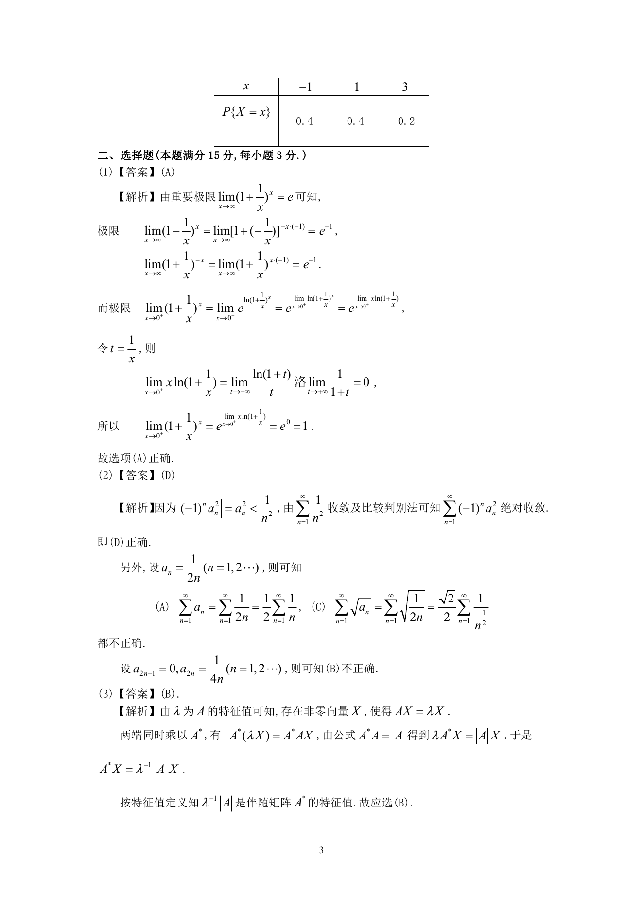

# 1991 数学三第 7 题

## 题目

设$0 \le a_n < \frac{1}{n}$ ($n = 1,2, \cdots$)，则下列级数中肯定收敛的是（ ）

A. $\sum_{n = 1}^{\infty}a_n$．

B. $\sum_{n = 1}^{\infty}(- 1)^n a_n$．

C. $\sum_{n = 1}^{\infty}\sqrt{a_n}$．

D. $\sum_{n = 1}^{\infty}(- 1)^n a_n^2$．

## 标准答案

D

## 解析

答案为 D。解析见下方答案解析页图；PDF 文本层公式不稳定，未直接转写为 LaTeX。

## 答案解析页图

## 来源

- 题目来源：1991 年数学三 TeX 试卷源（试卷四）。
- 答案解析来源：1991年数学三真题答案解析.pdf。
- 页面图只作为原卷/解析复核依据；题干正文已按 TeX 源整理为 LaTeX。
