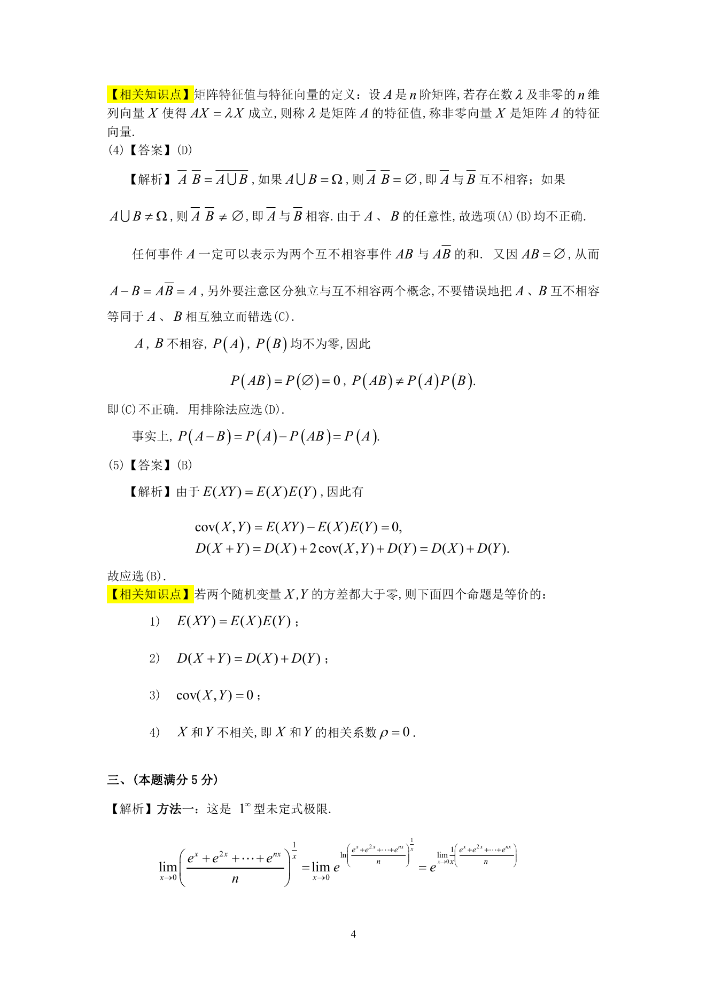

# 1991 数学三第 10 题

## 题目

对于任意两个随机变量$X$和$Y$，若$E(XY) = E(X) \cdot E(Y)$，则（ ）

A. $D(XY) = D(X) \cdot D(Y)$．

B. $D(X + Y) = D(X) + D(Y)$．

C. $X$和$Y$独立．

D. $X$和$Y$不独立．

## 标准答案

B

## 解析

答案为 B。解析见下方答案解析页图；PDF 文本层公式不稳定，未直接转写为 LaTeX。

## 答案解析页图

## 来源

- 题目来源：1991 年数学三 TeX 试卷源（试卷四）。
- 答案解析来源：1991年数学三真题答案解析.pdf。
- 页面图只作为原卷/解析复核依据；题干正文已按 TeX 源整理为 LaTeX。
