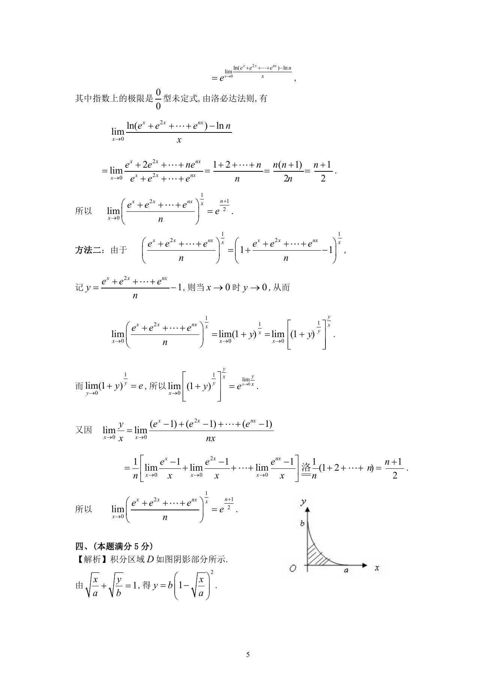
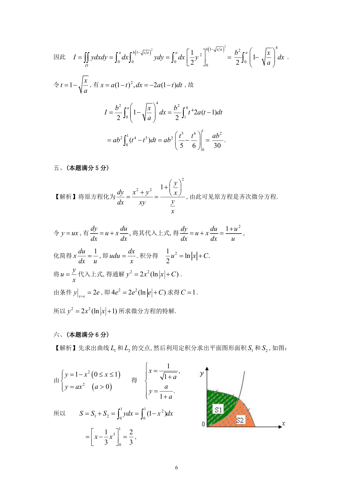

# 1991 数学三第 12 题

## 题目

计算二重积分$I = \iint_D y\,\mathrm{d}x\,\mathrm{d}y$，其中$D$是由$x$轴，$y$轴与曲线$\sqrt{\frac{x}{a}} + \sqrt{\frac{y}{b}} = 1$所围成的区域，$a > 0,b > 0$．

## 标准答案

见答案解析页图

## 解析

解析见下方答案解析页图；PDF 文本层公式不稳定，未直接转写为 LaTeX。

## 答案解析页图

## 来源

- 题目来源：1991 年数学三 TeX 试卷源（试卷四）。
- 答案解析来源：1991年数学三真题答案解析.pdf。
- 页面图只作为原卷/解析复核依据；题干正文已按 TeX 源整理为 LaTeX。
