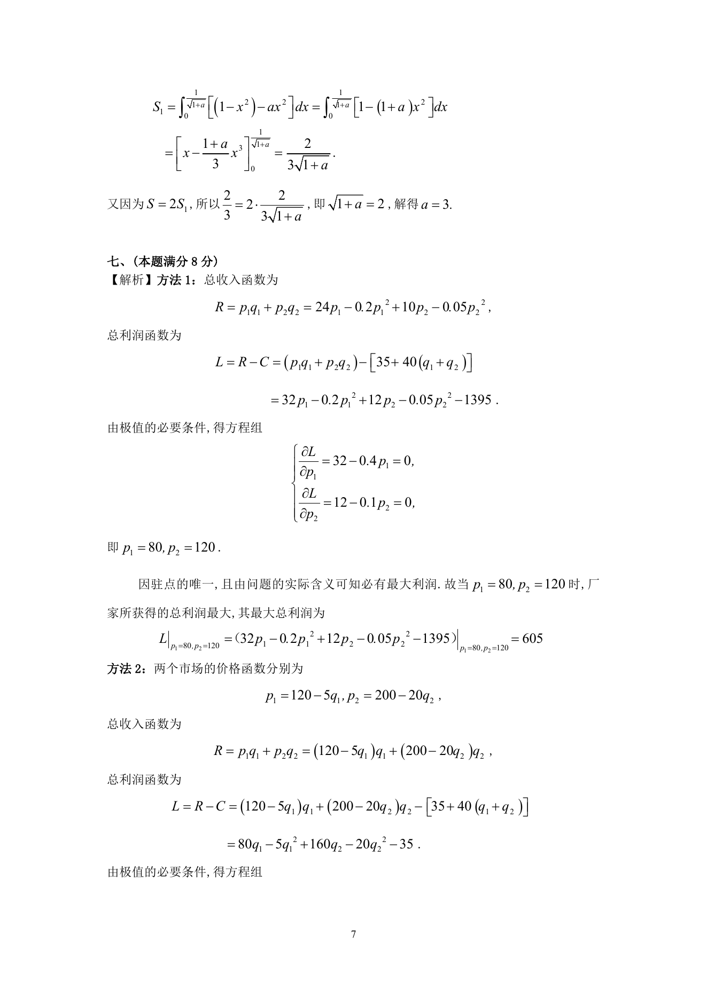
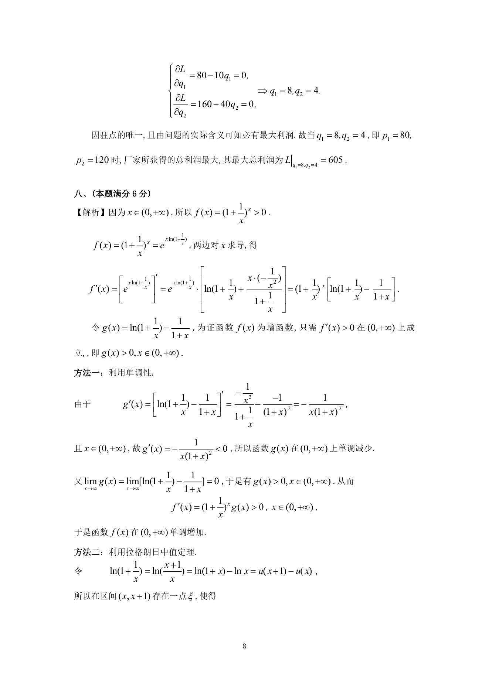

# 1991 数学三第 15 题

## 题目

某厂家生产的一种产品同时在两个市场销售，售价分别为$p_1$和$p_2$，
销售量分别为$q_1$和$q_2$，需求函数分别为$q_1 = 24 - 0.2p_1$和$q_2 = 10 - 0.05p_2$，
总成本函数为$C = 35 + 40\left(q_1 + q_2 \right)$．
试问：厂家如何确定两个市场的售价，能使其获得的总利润最大？最大利润为多少？

## 标准答案

见答案解析页图

## 解析

解析见下方答案解析页图；PDF 文本层公式不稳定，未直接转写为 LaTeX。

## 答案解析页图

## 来源

- 题目来源：1991 年数学三 TeX 试卷源（试卷四）。
- 答案解析来源：1991年数学三真题答案解析.pdf。
- 页面图只作为原卷/解析复核依据；题干正文已按 TeX 源整理为 LaTeX。
