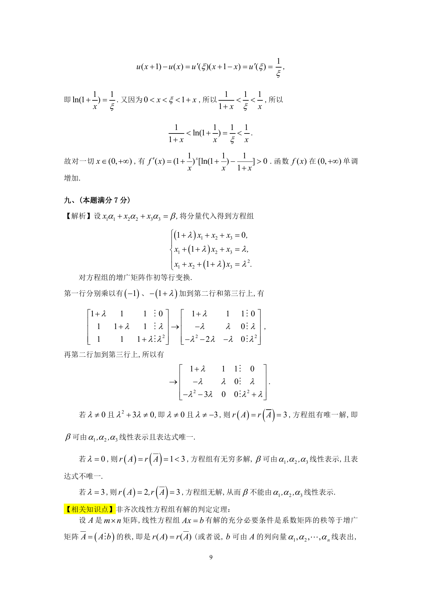

# 1991 数学三第 17 题

## 题目

设有三维列向量
$$\alpha_1 = \begin{pmatrix}
1 + \lambda \\
1 \\
1
\end{pmatrix},\alpha_2 = \begin{pmatrix}
1 \\
1 + \lambda \\
1
\end{pmatrix},\alpha_3 = \begin{pmatrix}
1 \\
1 \\
1 + \lambda
\end{pmatrix},\beta = \begin{pmatrix}
0 \\
\lambda \\
\lambda^2
\end{pmatrix},$$
问$\lambda$取何值时，

1. $\beta$可由$\alpha_1,\alpha_2,\alpha_3$线性表示，且表达式唯一？
2. $\beta$可由$\alpha_1,\alpha_2,\alpha_3$线性表示，且表达式不唯一？
3. $\beta$不能由$\alpha_1,\alpha_2,\alpha_3$线性表示？

## 标准答案

见答案解析页图

## 解析

解析见下方答案解析页图；PDF 文本层公式不稳定，未直接转写为 LaTeX。

## 答案解析页图

## 来源

- 题目来源：1991 年数学三 TeX 试卷源（试卷四）。
- 答案解析来源：1991年数学三真题答案解析.pdf。
- 页面图只作为原卷/解析复核依据；题干正文已按 TeX 源整理为 LaTeX。
