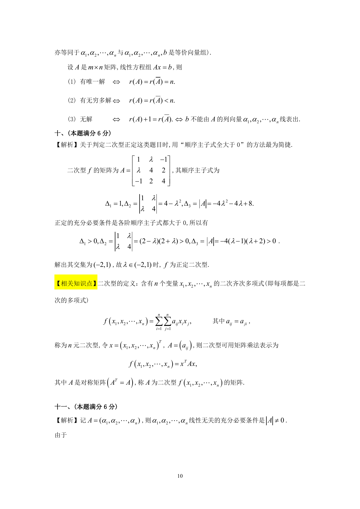

# 1991 数学三第 18 题

## 题目

考虑二次型$f = x_1^2+ 4x_2^2+ 4x_3^2+ 2\lambda x_1x_2 - 2x_1x_3 + 4x_2x_3$．
问$\lambda$取何值时，$f$为正定二次型？

## 标准答案

见答案解析页图

## 解析

解析见下方答案解析页图；PDF 文本层公式不稳定，未直接转写为 LaTeX。

## 答案解析页图

## 来源

- 题目来源：1991 年数学三 TeX 试卷源（试卷四）。
- 答案解析来源：1991年数学三真题答案解析.pdf。
- 页面图只作为原卷/解析复核依据；题干正文已按 TeX 源整理为 LaTeX。
