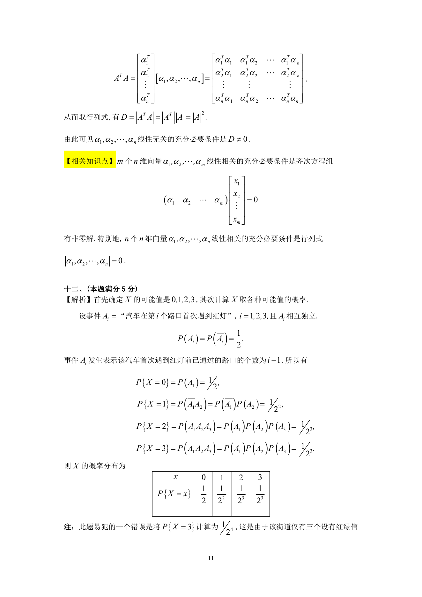
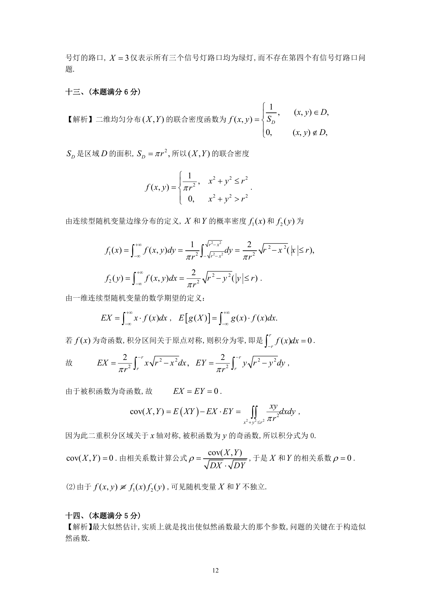

# 1991 数学三第 20 题

## 题目

一汽车沿一街道行驶，需要通过三个均设有红绿信号灯的路口，
每个信号灯为红或绿与其他信号灯为红或绿相互独立，且红绿两种信号显示的时间相等，
以$X$表示该汽车首次遇到红灯前已通过的路口的个数．求$X$的概率分布．

## 标准答案

见答案解析页图

## 解析

解析见下方答案解析页图；PDF 文本层公式不稳定，未直接转写为 LaTeX。

## 答案解析页图

## 来源

- 题目来源：1991 年数学三 TeX 试卷源（试卷四）。
- 答案解析来源：1991年数学三真题答案解析.pdf。
- 页面图只作为原卷/解析复核依据；题干正文已按 TeX 源整理为 LaTeX。
