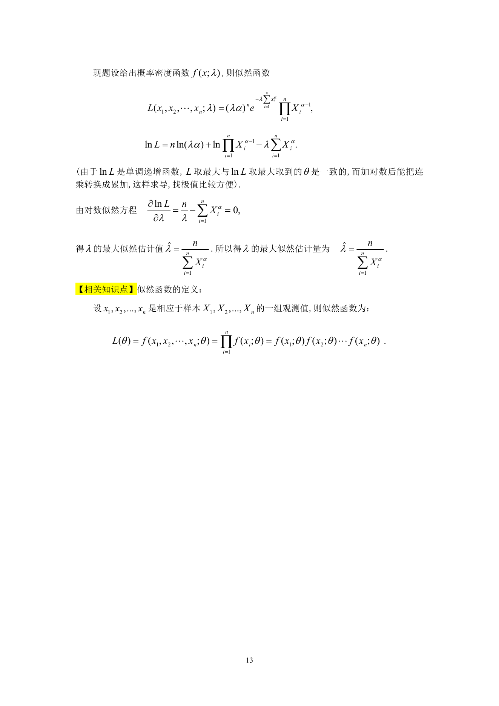

# 1991 数学三第 22 题

## 题目

设总体$X$的概率密度为
$$p(x;\lambda) = \begin{cases}
\lambda ax^{a-1}\mathrm{e}^{-\lambda x^a}, & x > 0, \\
0, & x \le 0,
\end{cases}$$
其中$\lambda > 0$是未知参数，$a > 0$是已知常数．
试根据来自总体$X$的简单随机样本$x_1,x_2, \cdots ,x_n$,
求$\lambda$的最大似然估计量$\hat{\lambda}$．

## 标准答案

见答案解析页图

## 解析

解析见下方答案解析页图；PDF 文本层公式不稳定，未直接转写为 LaTeX。

## 答案解析页图

## 来源

- 题目来源：1991 年数学三 TeX 试卷源（试卷四）。
- 答案解析来源：1991年数学三真题答案解析.pdf。
- 页面图只作为原卷/解析复核依据；题干正文已按 TeX 源整理为 LaTeX。
