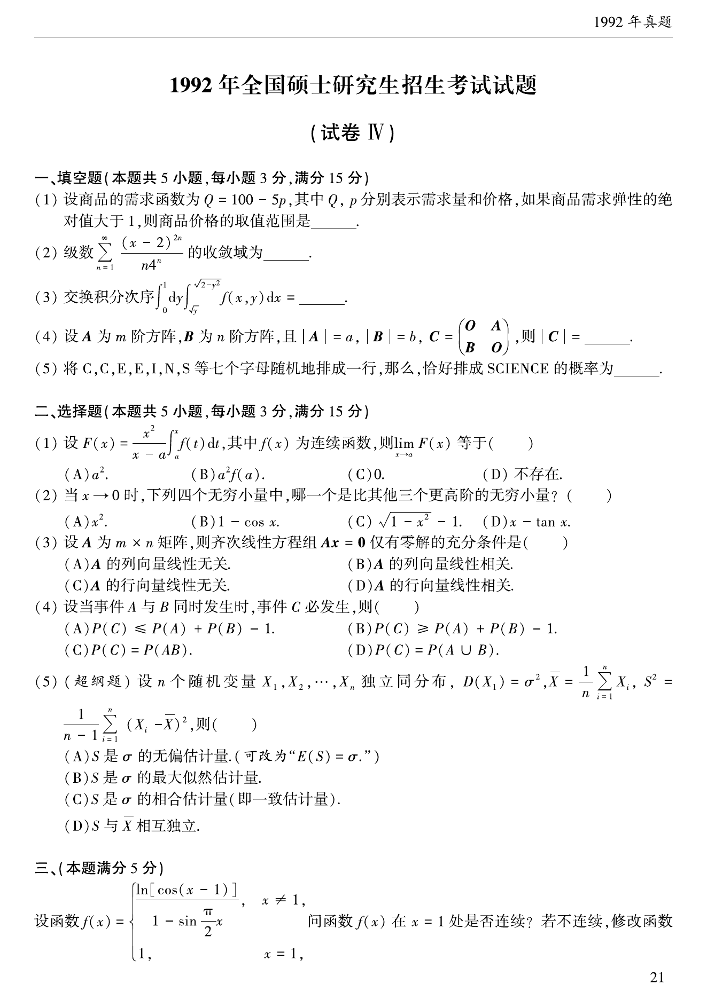
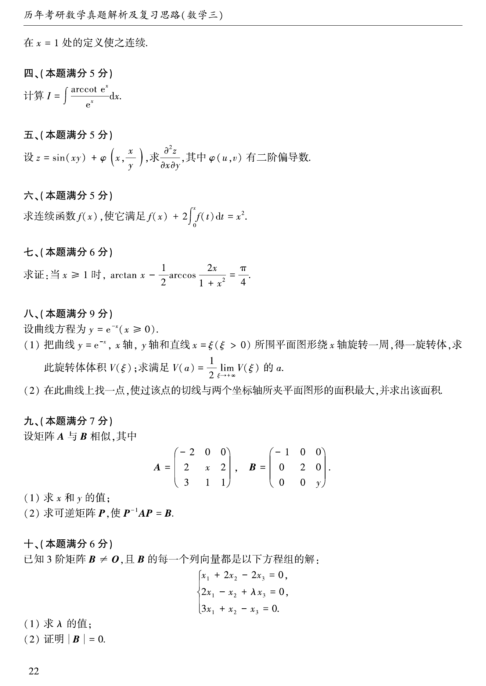
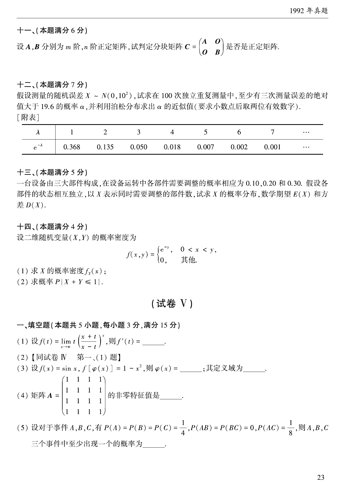
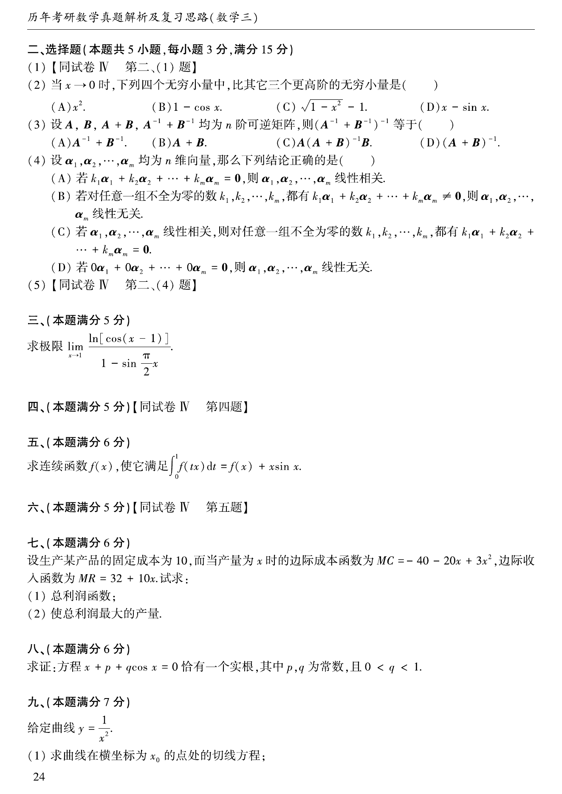

# 1992 年考研数学三真题

资料类型：考研数学三历年真题
年份：1992
科目：数学三
整理状态：TeX 题干源整理，答案解析 PDF 文本层拆分

## 原卷页图

## 填空题（本题共5小题，每小题3分，满分15分）

### 第 1 题

- 题型：填空题
- 题号：1
- 分值：3
- 模块：高等数学
- 校对状态：已按 TeX 源整理

设商品的需求函数为$Q = 100 - 5P$，其中$Q,P$分别表示为需求量和价格，如果商品需求弹性的绝对值大于$1$，则商品价格的取值范围是 ____．

### 第 2 题

- 题型：填空题
- 题号：2
- 分值：3
- 模块：高等数学
- 校对状态：已按 TeX 源整理

级数$\sum_{n = 1}^{\infty}\frac{(x - 2)^{2n}}{n4^n}$的收敛域为 ____．

### 第 3 题

- 题型：填空题
- 题号：3
- 分值：3
- 模块：高等数学
- 校对状态：已按 TeX 源整理

交换积分次序$\int_0^1\,\mathrm{d}y \int_{\sqrt{y}}^{\sqrt{2 - y^2}} f(x,y)\,\mathrm{d}x =$ ____．

### 第 4 题

- 题型：填空题
- 题号：4
- 分值：3
- 模块：高等数学
- 校对状态：已按 TeX 源整理

设$A$为$m$阶方阵，$B$为$n$阶方阵，且$|A| = a$, $|B| = b$, $C = \begin{pmatrix}
O & A \\
B & O
\end{pmatrix}$，则$|C| =$ ____．

### 第 5 题

- 题型：填空题
- 题号：5
- 分值：3
- 模块：概率统计
- 校对状态：已按 TeX 源整理

将 C, C, E, E, I, N, S 这七个字母随机地排成一行，那么恰好排成英文单词~\hbox{SCIENCE}~的概率为 ____．

## 选择题（本题共5小题，每小题3分，满分15分）

### 第 6 题

- 题型：选择题
- 题号：6
- 分值：3
- 模块：高等数学
- 校对状态：已按 TeX 源整理

设$F(x) = \frac{x^2}{x - a}\int_a^x f(t) \,\mathrm{d}t$，其中$f(x)$为连续函数，则$\lim_{x \to a} F(x)$等于（ ）

A. $a^2$．

B. $a^2 f(a)$．

C. $0$．

D. 不存在．

### 第 7 题

- 题型：选择题
- 题号：7
- 分值：3
- 模块：高等数学
- 校对状态：已按 TeX 源整理

当$x \to 0$时，下面四个无穷小量中，哪一个是比其他三个更高阶的无穷小量？（ ）

A. $x^2$．

B. $1 - \cos x$．

C. $\sqrt{1 - x^2} - 1$．

D. $x - \tan x$．

### 第 8 题

- 题型：选择题
- 题号：8
- 分值：3
- 模块：线性代数
- 校对状态：已按 TeX 源整理

设$A$为$m \times n$矩阵，齐次线性方程组$Ax = 0$仅有零解的充分条件是（ ）

A. $A$的列向量线性无关．

B. $A$的列向量线性相关．

C. $A$的行向量线性无关．

D. $A$的行向量线性相关．

### 第 9 题

- 题型：选择题
- 题号：9
- 分值：3
- 模块：高等数学
- 校对状态：已按 TeX 源整理

设当事件$A$与$B$同时发生时，事件$C$必发生，则（ ）

A. $P(C) \le P(A) + P(B) - 1$．

B. $P(C) \ge P(A) + P(B)- 1$．

C. $P(C)= P(AB)$．

D. $P(C) = P(A \cup B)$．

### 第 10 题

- 题型：选择题
- 题号：10
- 分值：3
- 模块：概率统计
- 校对状态：已按 TeX 源整理

设$n$个随机变量$X_1$, $X_2$, $\cdots$, $X_n$独立同分布，
$$D(X_1) = \sigma^2, \overline{X}= \frac{1}{n}\sum_{i = 1}^n X_i,
S^2 = \frac{1}{n - 1}\sum_{i = 1}^n (X_i - \overline{X})^2,$$
则（ ）

A. $S$是$\sigma$的无偏估计量．

B. $S$是$\sigma$的最大似然估计量．

C. $S$是$\sigma$的相合估计量（即一致估计量）．

D. $S$与$\overline{X}$相互独立．

## 第 3 部分（本题满分5分）

### 第 11 题

- 题型：解答题
- 题号：11
- 分值：5
- 模块：高等数学
- 校对状态：已按 TeX 源整理

设函数$f(x) = \begin{cases}
\frac{\ln\cos(x-1)}{1-\sin\frac{\pi x}{2}}, & x \ne 1, \\
1, & x = 1.
\end{cases}$问函数$f(x)$在$x = 1$处是否连续？若不连续，修改函数在$x = 1$处的定义使之连续．

## 第 4 部分（本题满分5分）

### 第 12 题

- 题型：解答题
- 题号：12
- 分值：5
- 模块：高等数学
- 校对状态：已按 TeX 源整理

计算$I = \int \frac{\arccot\mathrm{e}^x}{\mathrm{e}^x} \,\mathrm{d}x$．

## 第 5 部分（本题满分5分）

### 第 13 题

- 题型：解答题
- 题号：13
- 分值：5
- 模块：高等数学
- 校对状态：已按 TeX 源整理

设$z = \sin(xy) + \varphi(x,\frac{x}{y})$，求$\frac{

tial^2 z}{

tialx

tial y}$，其中$\varphi (u,v)$有二阶偏导数．

## 第 6 部分（本题满分5分）

### 第 14 题

- 题型：解答题
- 题号：14
- 分值：5
- 模块：高等数学
- 校对状态：已按 TeX 源整理

求连续函数$f(x)$，使它满足$f(x) + 2\int_0^x f(t)\,\mathrm{d}t = x^2$．

## 第 7 部分（本题满分6分）

### 第 15 题

- 题型：解答题
- 题号：15
- 分值：6
- 模块：高等数学
- 校对状态：已按 TeX 源整理

求证：当$x \ge 1$时，$\arctan x - \frac{1}{2}\arccos \frac{2x}{1 + x^2} = \frac{\pi}{4}$．

## 第 8 部分（本题满分9分）

### 第 16 题

- 题型：解答题
- 题号：16
- 分值：9
- 模块：高等数学
- 校对状态：已按 TeX 源整理

设曲线方程$y = \mathrm{e}^{- x}$（$x \ge 0$）．

1. 把曲线$y = \mathrm{e}^{- x}$,$x$轴，$y$轴和直线$x = \xi(\xi > 0)$所围成平面图形绕$x$轴旋转一周，
得一旋转体，求此旋转体体积$V(\xi)$；求满足$V(a) = \frac{1}{2}\lim_{\xi \to +\infty} V(\xi)$的$a$．
2. 在此曲线上找一点，使过该点的切线与两个坐标轴所夹平面图形的面积最大，并求出该面积．

## 第 9 部分（本题满分7分）

### 第 17 题

- 题型：解答题
- 题号：17
- 分值：7
- 模块：线性代数
- 校对状态：已按 TeX 源整理

设矩阵$A$与$B$相似，其中
$$A = \begin{pmatrix}
-2 & 0 & 0 \\
2 & x & 2 \\
3 & 1 & 1
\end{pmatrix}, B = \begin{pmatrix}
-1 & 0 & 0 \\
0 & 2 & 0 \\
0 & 0 & y
\end{pmatrix}.$$

1. 求$x$和$y$的值．
2. 求可逆矩阵$P$，使得$P^{-1} AP = B$．

## 第 10 部分（本题满分6分）

### 第 18 题

- 题型：解答题
- 题号：18
- 分值：6
- 模块：线性代数
- 校对状态：已按 TeX 源整理

已知三阶矩阵$B \ne 0$，且$B$的每一个列向量都是以下方程组的解:
$$\begin{cases}
x_1 + 2x_2 - 2x_3 = 0, \\
2x_1 - x_2 + \lambda x_3 = 0, \\
3x_1 + x_2 - x_3 = 0.
\end{cases}$$

1. 求$\lambda$的值；
2. 证明$|B| = 0$．

## 第 11 部分（本题满分6分）

### 第 19 题

- 题型：解答题
- 题号：19
- 分值：6
- 模块：线性代数
- 校对状态：已按 TeX 源整理

设$A$,$B$分别为$m$,$n$阶正定矩阵，试判定分块矩阵$C = \begin{pmatrix}
A & 0 \\
0 & B
\end{pmatrix}$是否是正定矩阵．

## 第 12 部分（本题满分7分）

### 第 20 题

- 题型：解答题
- 题号：20
- 分值：7
- 模块：概率统计
- 校对状态：已按 TeX 源整理

假设测量的随机误差$X\sim N(0,10^2)$，试求$100$次独立重复测量中，至少有三次测量误差的绝对值大于$19.6$的概率$\alpha$，并利用泊松分布求出$\alpha$的近似值（要求小数点后取两位有效数字）．

\centerline{[附表]}
$$\begin{array}{|c|*{8}{c}|}
\hline
\lambda & 1 & 2 & 3 & 4 & 5 & 6 & 7 & \cdots \\
\hline
\mathrm{e}^{-\lambda} & 0.368 & 0.135 & 0.050 & 0.018 & 0.007 & 0.002 & 0.001 & \cdots \\
\hline
\end{array}$$

## 第 13 部分（本题满分5分）

### 第 21 题

- 题型：解答题
- 题号：21
- 分值：5
- 模块：概率统计
- 校对状态：已按 TeX 源整理

一台设备由三大部分构成，在设备运转中各部件需要调整的概率相应为$0.10$, $0.20$ 和$0.30$．
假设各部件的状态相互独立，以$X$表示同时需要调整的部件数，试求$X$的概率分布，数学期望$EX$和方差$DX$．

## 第 14 部分（本题满分4分）

### 第 22 题

- 题型：解答题
- 题号：22
- 分值：4
- 模块：概率统计
- 校对状态：已按 TeX 源整理

设二维随机变量$(X,Y)$的概率密度为
$$f(x,y) = \begin{cases}
\mathrm{e}^{- y}, & 0 < x < y, \\
0, & 其他,
\end{cases}$$

1. 求随机变量$X$的密度$f_X(x)$；
2. 求概率$P\{X + Y \le 1\}$．
