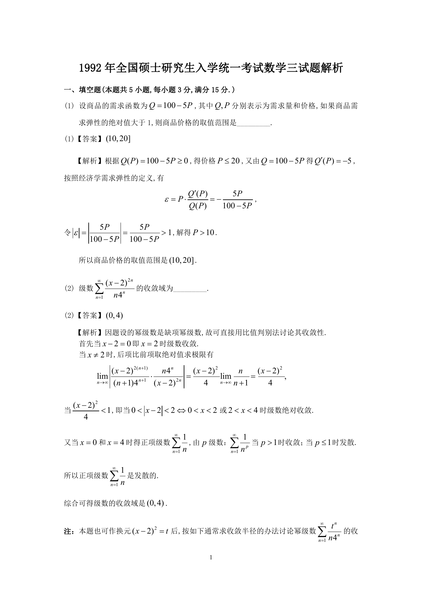

# 1992 数学三第 1 题

## 题目

设商品的需求函数为$Q = 100 - 5P$，其中$Q,P$分别表示为需求量和价格，如果商品需求弹性的绝对值大于$1$，则商品价格的取值范围是 \underline{\qquad}．

## 标准答案

(10,20]

## 解析

答案为 (10,20]。解析见下方答案解析页图；PDF 文本层公式不稳定，未直接转写为 LaTeX。

## 答案解析页图

## 来源

- 题目来源：1992 年数学三 TeX 试卷源（试卷四）。
- 答案解析来源：1992年数学三真题答案解析.pdf。
- 页面图只作为原卷/解析复核依据；题干正文已按 TeX 源整理为 LaTeX。
