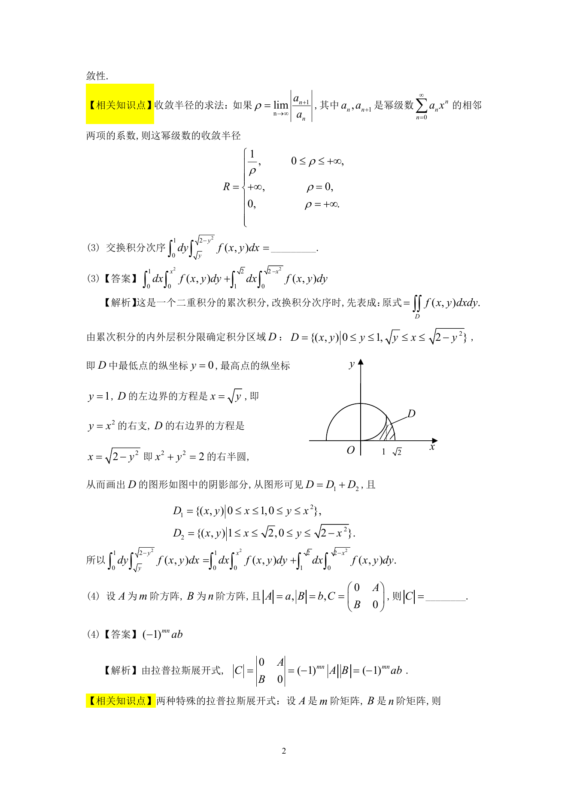

# 1992 数学三第 2 题

## 题目

级数$\sum_{n = 1}^{\infty}\frac{(x - 2)^{2n}}{n4^n}$的收敛域为 \underline{\qquad}．

## 标准答案

(0,4)

## 解析

答案为 (0,4)。解析见下方答案解析页图；PDF 文本层公式不稳定，未直接转写为 LaTeX。

## 答案解析页图

## 来源

- 题目来源：1992 年数学三 TeX 试卷源（试卷四）。
- 答案解析来源：1992年数学三真题答案解析.pdf。
- 页面图只作为原卷/解析复核依据；题干正文已按 TeX 源整理为 LaTeX。
