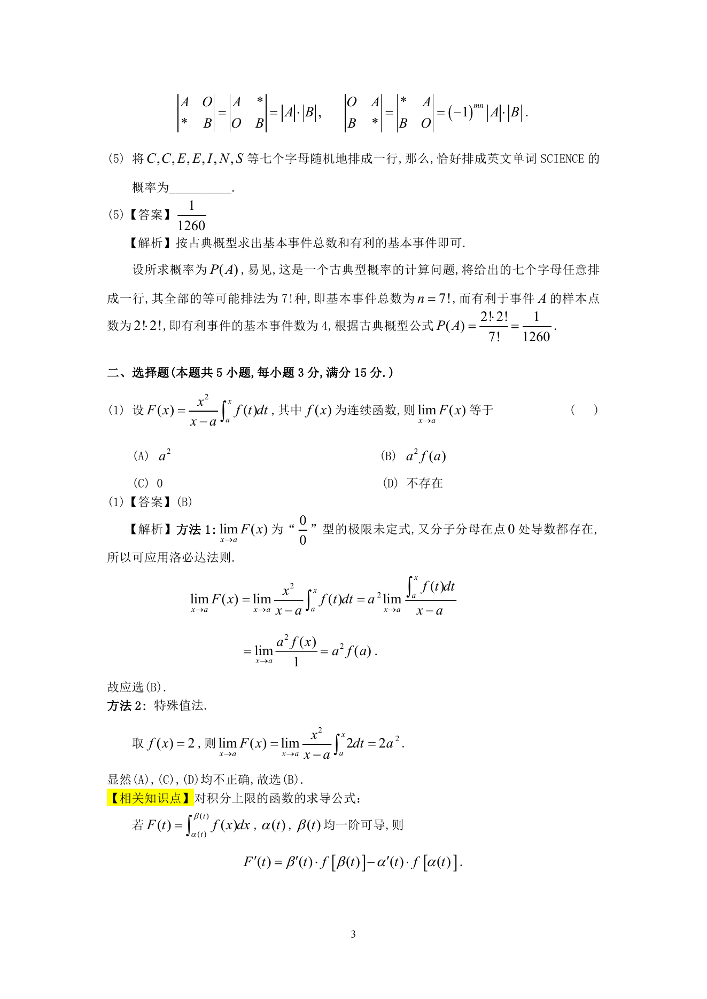

# 1992 数学三第 4 题

## 题目

设$A$为$m$阶方阵，$B$为$n$阶方阵，且$|A| = a$, $|B| = b$, $C = \begin{pmatrix}
O & A \\
B & O
\end{pmatrix}$，则$|C| =$ \underline{\qquad}．

## 标准答案

见答案解析页图

## 解析

该题答案见下方答案解析页图；PDF 文本层顺序和公式不稳定，未直接转写为标准 LaTeX 文本。

## 答案解析页图

## 来源

- 题目来源：1992 年数学三 TeX 试卷源（试卷四）。
- 答案解析来源：1992年数学三真题答案解析.pdf。
- 页面图只作为原卷/解析复核依据；题干正文已按 TeX 源整理为 LaTeX。
