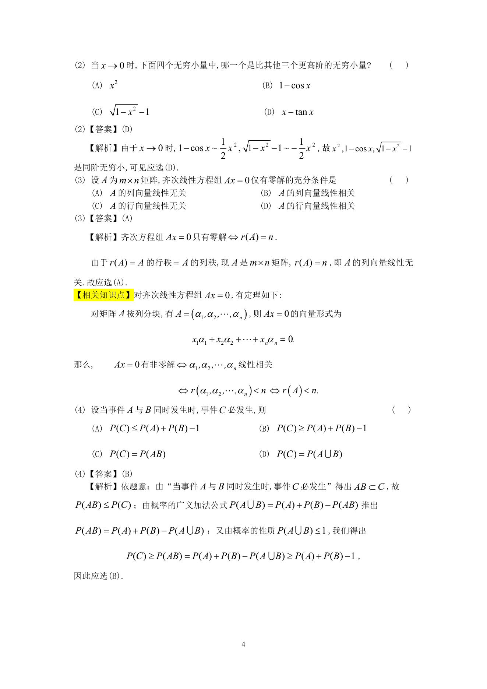

# 1992 数学三第 8 题

## 题目

设$A$为$m \times n$矩阵，齐次线性方程组$Ax = 0$仅有零解的充分条件是（ ）

A. $A$的列向量线性无关．

B. $A$的列向量线性相关．

C. $A$的行向量线性无关．

D. $A$的行向量线性相关．

## 标准答案

A

## 解析

答案为 A。解析见下方答案解析页图；PDF 文本层公式不稳定，未直接转写为 LaTeX。

## 答案解析页图

## 来源

- 题目来源：1992 年数学三 TeX 试卷源（试卷四）。
- 答案解析来源：1992年数学三真题答案解析.pdf。
- 页面图只作为原卷/解析复核依据；题干正文已按 TeX 源整理为 LaTeX。
