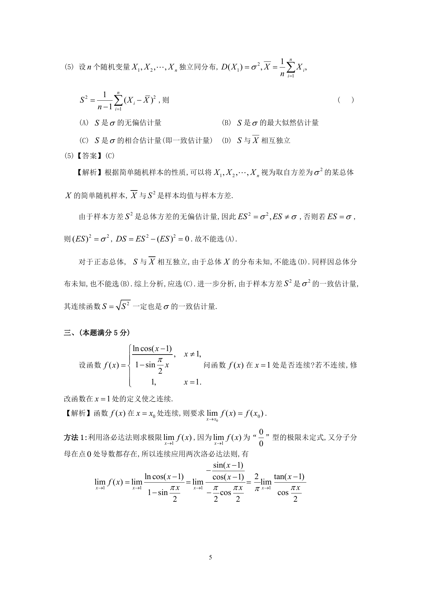

# 1992 数学三第 10 题

## 题目

设$n$个随机变量$X_1$, $X_2$, $\cdots$, $X_n$独立同分布，
$$D(X_1) = \sigma^2, \overline{X}= \frac{1}{n}\sum_{i = 1}^n X_i,
S^2 = \frac{1}{n - 1}\sum_{i = 1}^n (X_i - \overline{X})^2,$$
则（ ）

A. $S$是$\sigma$的无偏估计量．

B. $S$是$\sigma$的最大似然估计量．

C. $S$是$\sigma$的相合估计量（即一致估计量）．

D. $S$与$\overline{X}$相互独立．

## 标准答案

C

## 解析

答案为 C。解析见下方答案解析页图；PDF 文本层公式不稳定，未直接转写为 LaTeX。

## 答案解析页图

## 来源

- 题目来源：1992 年数学三 TeX 试卷源（试卷四）。
- 答案解析来源：1992年数学三真题答案解析.pdf。
- 页面图只作为原卷/解析复核依据；题干正文已按 TeX 源整理为 LaTeX。
