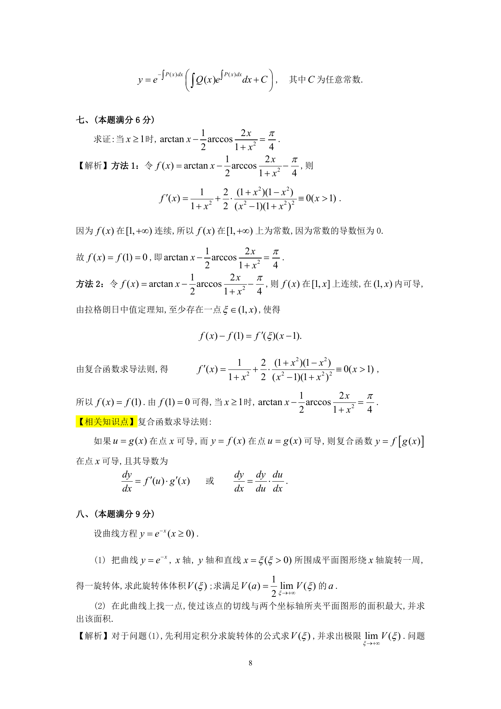

# 1992 数学三第 15 题

## 题目

求证：当$x \ge 1$时，$\arctan x - \frac{1}{2}\arccos \frac{2x}{1 + x^2} = \frac{\pi}{4}$．

## 标准答案

见答案解析页图

## 解析

解析见下方答案解析页图；PDF 文本层公式不稳定，未直接转写为 LaTeX。

## 答案解析页图

## 来源

- 题目来源：1992 年数学三 TeX 试卷源（试卷四）。
- 答案解析来源：1992年数学三真题答案解析.pdf。
- 页面图只作为原卷/解析复核依据；题干正文已按 TeX 源整理为 LaTeX。
