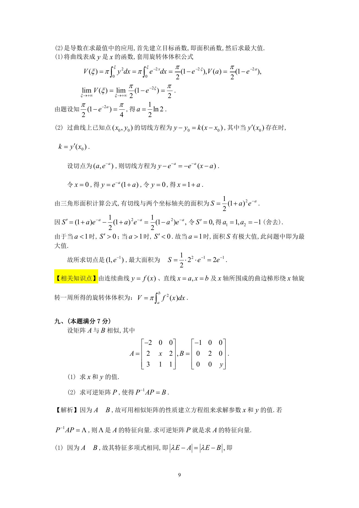

# 1992 数学三第 16 题

## 题目

设曲线方程$y = \mathrm{e}^{- x}$（$x \ge 0$）．

1. 把曲线$y = \mathrm{e}^{- x}$,$x$轴，$y$轴和直线$x = \xi(\xi > 0)$所围成平面图形绕$x$轴旋转一周，
得一旋转体，求此旋转体体积$V(\xi)$；求满足$V(a) = \frac{1}{2}\lim_{\xi \to +\infty} V(\xi)$的$a$．
2. 在此曲线上找一点，使过该点的切线与两个坐标轴所夹平面图形的面积最大，并求出该面积．

## 标准答案

见答案解析页图

## 解析

解析见下方答案解析页图；PDF 文本层公式不稳定，未直接转写为 LaTeX。

## 答案解析页图

## 来源

- 题目来源：1992 年数学三 TeX 试卷源（试卷四）。
- 答案解析来源：1992年数学三真题答案解析.pdf。
- 页面图只作为原卷/解析复核依据；题干正文已按 TeX 源整理为 LaTeX。
