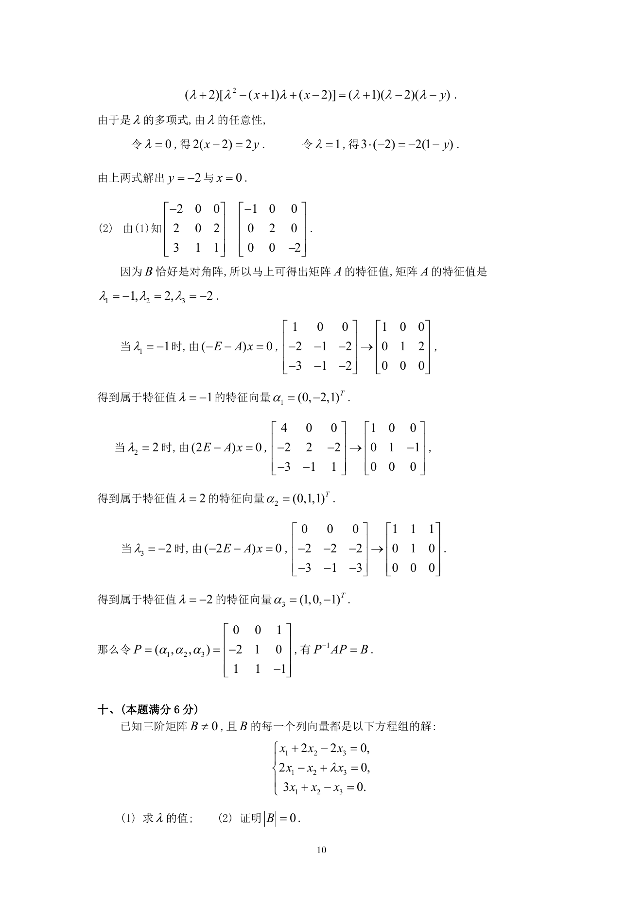

# 1992 数学三第 17 题

## 题目

设矩阵$A$与$B$相似，其中
$$A = \begin{pmatrix}
-2 & 0 & 0 \\
2 & x & 2 \\
3 & 1 & 1
\end{pmatrix}, B = \begin{pmatrix}
-1 & 0 & 0 \\
0 & 2 & 0 \\
0 & 0 & y
\end{pmatrix}.$$

1. 求$x$和$y$的值．
2. 求可逆矩阵$P$，使得$P^{-1} AP = B$．

## 标准答案

见答案解析页图

## 解析

解析见下方答案解析页图；PDF 文本层公式不稳定，未直接转写为 LaTeX。

## 答案解析页图

## 来源

- 题目来源：1992 年数学三 TeX 试卷源（试卷四）。
- 答案解析来源：1992年数学三真题答案解析.pdf。
- 页面图只作为原卷/解析复核依据；题干正文已按 TeX 源整理为 LaTeX。
