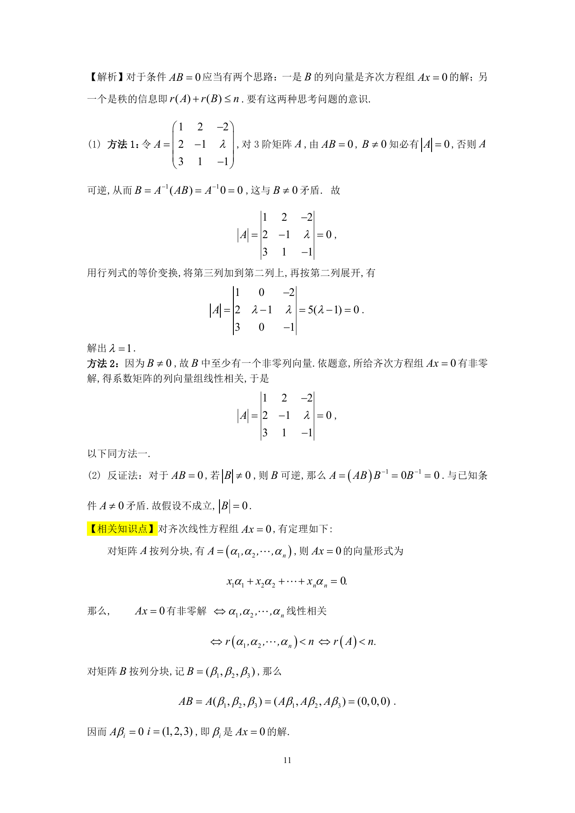

# 1992 数学三第 18 题

## 题目

已知三阶矩阵$B \ne 0$，且$B$的每一个列向量都是以下方程组的解:
$$\begin{cases}
x_1 + 2x_2 - 2x_3 = 0, \\
2x_1 - x_2 + \lambda x_3 = 0, \\
3x_1 + x_2 - x_3 = 0.
\end{cases}$$

1. 求$\lambda$的值；
2. 证明$|B| = 0$．

## 标准答案

见答案解析页图

## 解析

解析见下方答案解析页图；PDF 文本层公式不稳定，未直接转写为 LaTeX。

## 答案解析页图

## 来源

- 题目来源：1992 年数学三 TeX 试卷源（试卷四）。
- 答案解析来源：1992年数学三真题答案解析.pdf。
- 页面图只作为原卷/解析复核依据；题干正文已按 TeX 源整理为 LaTeX。
