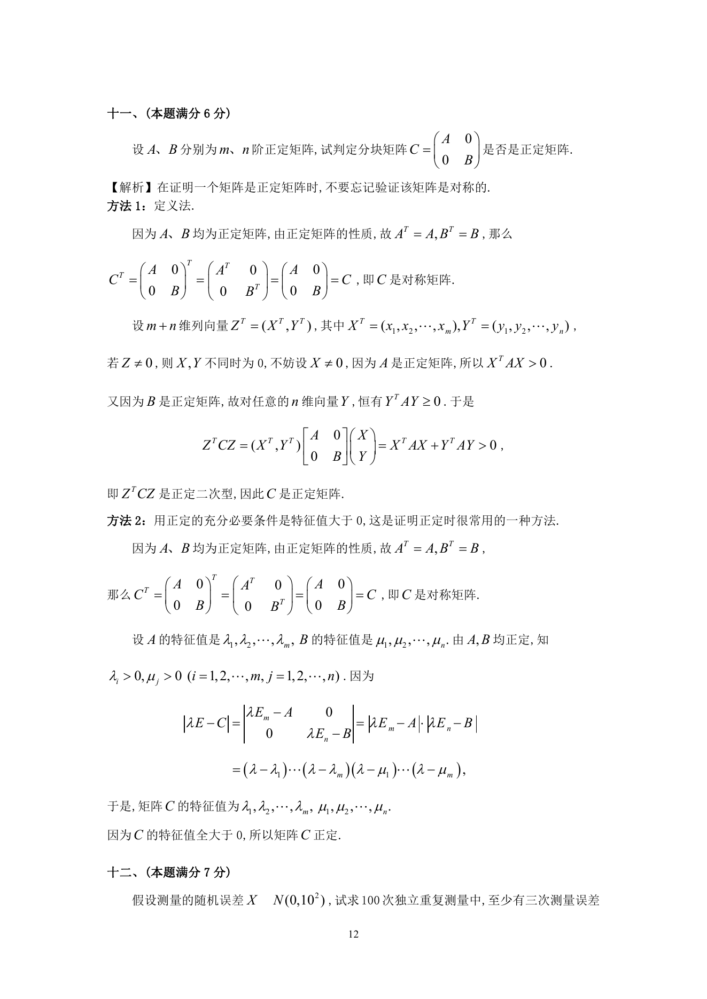

# 1992 数学三第 19 题

## 题目

设$A$,$B$分别为$m$,$n$阶正定矩阵，试判定分块矩阵$C = \begin{pmatrix}
A & 0 \\
0 & B
\end{pmatrix}$是否是正定矩阵．

## 标准答案

见答案解析页图

## 解析

解析见下方答案解析页图；PDF 文本层公式不稳定，未直接转写为 LaTeX。

## 答案解析页图

## 来源

- 题目来源：1992 年数学三 TeX 试卷源（试卷四）。
- 答案解析来源：1992年数学三真题答案解析.pdf。
- 页面图只作为原卷/解析复核依据；题干正文已按 TeX 源整理为 LaTeX。
