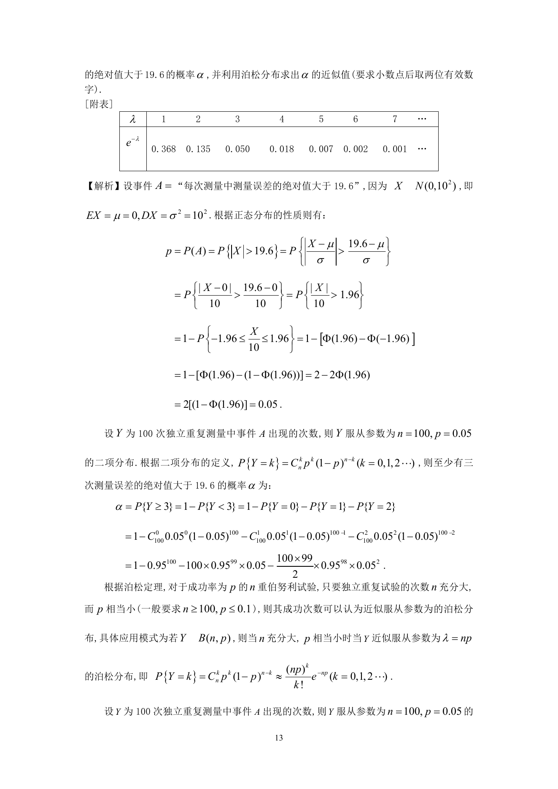
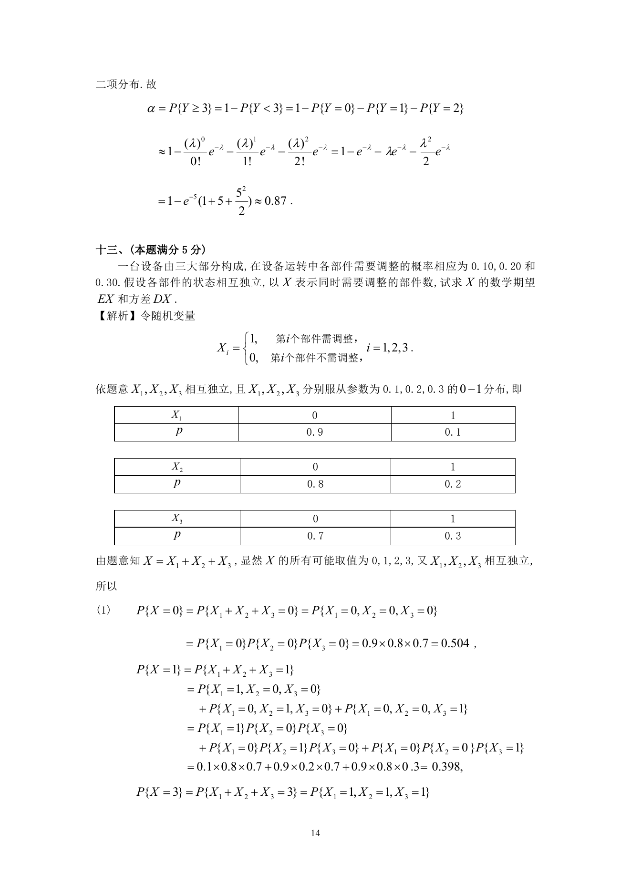

# 1992 数学三第 20 题

## 题目

假设测量的随机误差$X\sim N(0,10^2)$，试求$100$次独立重复测量中，至少有三次测量误差的绝对值大于$19.6$的概率$\alpha$，并利用泊松分布求出$\alpha$的近似值（要求小数点后取两位有效数字）．

\centerline{[附表]}
$$\begin{array}{|c|*{8}{c}|}
\hline
\lambda & 1 & 2 & 3 & 4 & 5 & 6 & 7 & \cdots \\
\hline
\mathrm{e}^{-\lambda} & 0.368 & 0.135 & 0.050 & 0.018 & 0.007 & 0.002 & 0.001 & \cdots \\
\hline
\end{array}$$

## 标准答案

见答案解析页图

## 解析

解析见下方答案解析页图；PDF 文本层公式不稳定，未直接转写为 LaTeX。

## 答案解析页图

## 来源

- 题目来源：1992 年数学三 TeX 试卷源（试卷四）。
- 答案解析来源：1992年数学三真题答案解析.pdf。
- 页面图只作为原卷/解析复核依据；题干正文已按 TeX 源整理为 LaTeX。
