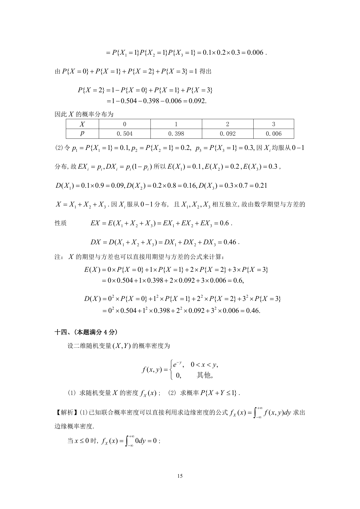
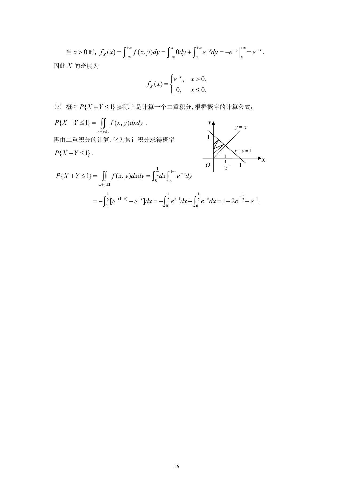

# 1992 数学三第 22 题

## 题目

设二维随机变量$(X,Y)$的概率密度为
$$f(x,y) = \begin{cases}
\mathrm{e}^{- y}, & 0 < x < y, \\
0, & 其他,
\end{cases}$$

1. 求随机变量$X$的密度$f_X(x)$；
2. 求概率$P\{X + Y \le 1\}$．

## 标准答案

见答案解析页图

## 解析

解析见下方答案解析页图；PDF 文本层公式不稳定，未直接转写为 LaTeX。

## 答案解析页图

## 来源

- 题目来源：1992 年数学三 TeX 试卷源（试卷四）。
- 答案解析来源：1992年数学三真题答案解析.pdf。
- 页面图只作为原卷/解析复核依据；题干正文已按 TeX 源整理为 LaTeX。
