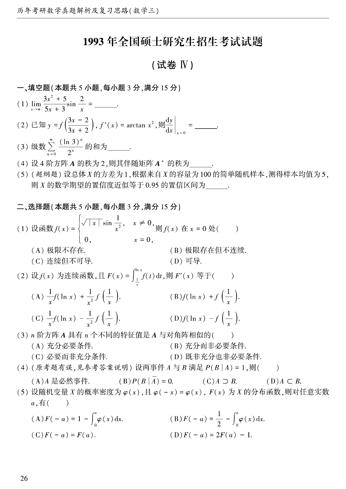
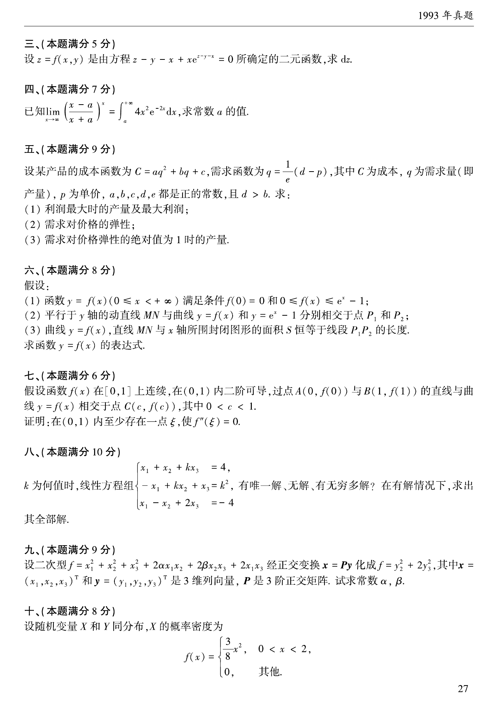
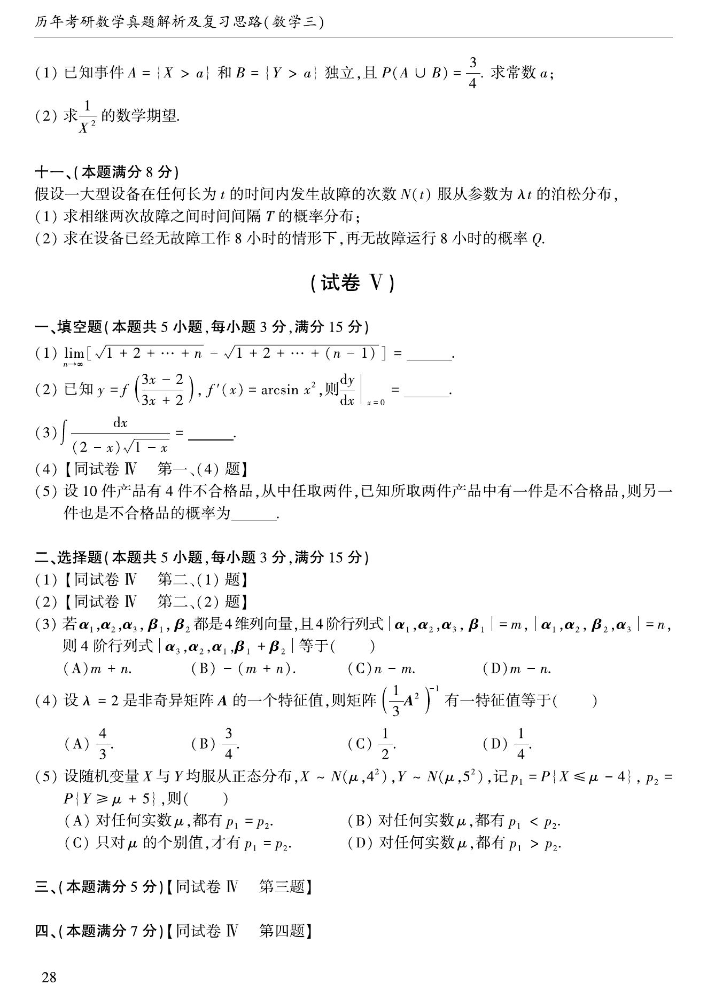
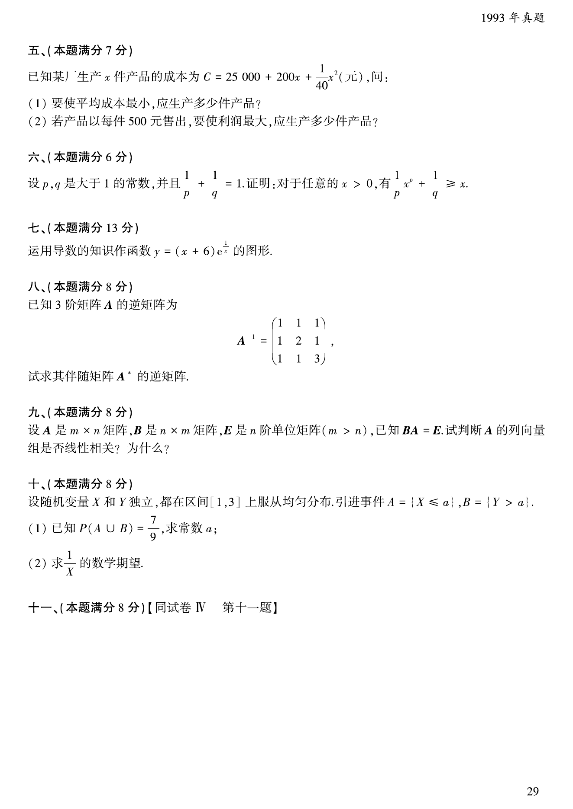

# 1993 年考研数学三真题

资料类型：考研数学三历年真题
年份：1993
科目：数学三
整理状态：TeX 题干源整理，答案解析 PDF 文本层拆分

## 原卷页图

## 填空题（本题共5小题，每小题3分，满分15分）

### 第 1 题

- 题型：填空题
- 题号：1
- 分值：3
- 模块：高等数学
- 校对状态：已按 TeX 源整理

$\lim_{x \to \infty} \frac{3x^2 + 5}{5x + 3}\sin \frac{2}{x} =$ ____．

### 第 2 题

- 题型：填空题
- 题号：2
- 分值：3
- 模块：高等数学
- 校对状态：已按 TeX 源整理

已知$y = f\left(\frac{3x - 2}{3x + 2} \right),f'(x)
= \arctan x^2$，则$\left. \frac{\,\mathrm{d}y}{\,\mathrm{d}x} \right|_{x = 0} =$ ____．

### 第 3 题

- 题型：填空题
- 题号：3
- 分值：3
- 模块：高等数学
- 校对状态：已按 TeX 源整理

级数$\sum_{n = 0}^{\infty}\frac{(\ln 3)^n}{2^n}$的和为 ____．

### 第 4 题

- 题型：填空题
- 题号：4
- 分值：3
- 模块：线性代数
- 校对状态：已按 TeX 源整理

设$4$阶方阵$A$的秩为$2$，则其伴随矩阵$A^*$的秩为 ____．

### 第 5 题

- 题型：填空题
- 题号：5
- 分值：3
- 模块：概率统计
- 校对状态：已按 TeX 源整理

设总体$X$的方差为1，根据来自$X$的容量为$100$的简单随机样本，测得样本均值为$5$,
则$X$的数学期望的置信度近似等于$0.95$的置信区间为 ____．

## 选择题（本题共5小题，每小题3分，满分15分）

### 第 6 题

- 题型：选择题
- 题号：6
- 分值：3
- 模块：高等数学
- 校对状态：已按 TeX 源整理

设$f(x) =$$\begin{cases}
\sqrt{|x|}\sin\frac{1}{x^2}, & x \ne 0, \\
0, & x = 0,
\end{cases}$则$f(x)$在点$x=0$处（ ）

A. 极限不存在．

B. 极限存在但不连续．

C. 连续但不可导．

D. 可导．

### 第 7 题

- 题型：选择题
- 题号：7
- 分值：3
- 模块：高等数学
- 校对状态：已按 TeX 源整理

设$f(x)$为连续函数，且$F(x) = \int_{\frac{1}{x}}^{\ln x} f(t) \,\mathrm{d}t$，
则$F'(x)$等于（ ）

A. $\frac{1}{x}f\left(\ln x \right) + \frac{1}{x^2}f\left(\frac{1}{x} \right)$．

B. $\frac{1}{x}f\left(\ln x \right) + f\left(\frac{1}{x} \right)$．

C. $\frac{1}{x}f\left(\ln x \right) - \frac{1}{x^2}f\left(\frac{1}{x} \right)$．

D. $f\left(\ln x \right) - f\left(\frac{1}{x} \right)$．

### 第 8 题

- 题型：选择题
- 题号：8
- 分值：3
- 模块：线性代数
- 校对状态：已按 TeX 源整理

$n$阶方阵$A$具有$n$个不同的特征值是$A$与对角阵相似的（ ）

A. 充分必要条件．

B. 充分而非必要条件．

C. 必要而非充分条件．

D. 既非充分也非必要条件．

### 第 9 题

- 题型：选择题
- 题号：9
- 分值：3
- 模块：高等数学
- 校对状态：已按 TeX 源整理

假设事件$A$和$B$满足$P(B|A) = 1$，则（ ）

A. $A$是必然事件．

B. $P(B|\overline{A}) = 0$．

C. $A \supset B$．

D. $A \subset B$．

### 第 10 题

- 题型：选择题
- 题号：10
- 分值：3
- 模块：概率统计
- 校对状态：已按 TeX 源整理

设随机变量$X$的密度函数为$\varphi (x)$，且$\varphi(-x)=\varphi(x)$，
$F(x)$是$X$的分布函数，则对任意实数$a$，有（ ）

A. $F(- a) = 1 - \int_0^a \varphi(x)\,\mathrm{d}x$．

B. $F(- a) = \frac{1}{2} - \int_0^a \varphi(x)\,\mathrm{d}x$．

C. $F(- a) = F(a)$．

D. $F(- a) = 2F(a) - 1$．

## 第 3 部分（本题满分5分）

### 第 11 题

- 题型：解答题
- 题号：11
- 分值：5
- 模块：高等数学
- 校对状态：已按 TeX 源整理

设$z = f\left(x,y \right)$是由方程$z - y - x + x\mathrm{e}^{z - y - x} = 0$所确定的二元函数，求$\,\mathrm{d}z$．

## 第 4 部分（本题满分7分）

### 第 12 题

- 题型：解答题
- 题号：12
- 分值：7
- 模块：高等数学
- 校对状态：已按 TeX 源整理

已知$\lim_{x \to \infty} \left(\frac{x - a}{x + a} \right)^x
= \int_a^{+\infty} 4x^2\mathrm{e}^{- 2x} \,\mathrm{d}x$，求常数$a$的值．

## 第 5 部分（本题满分9分）

### 第 13 题

- 题型：解答题
- 题号：13
- 分值：9
- 模块：高等数学
- 校对状态：已按 TeX 源整理

设某产品的成本函数为$C = aq^2 + bq + c$，需求函数为$q = \frac{1}{e}(d - p)$，其中$C$为成本，
$q$为需求量（即产量），$p$为单价，$a$, $b$, $c$, $d$, $e$都是正的常数，且$d > b$，求：

1. 利润最大时的产量及最大利润；
2. 需求对价格的弹性；
3. 需求对价格弹性的绝对值为$1$时的产量．

## 第 6 部分（本题满分8分）

### 第 14 题

- 题型：解答题
- 题号：14
- 分值：8
- 模块：高等数学
- 校对状态：已按 TeX 源整理

假设：

1. 函数$y = f(x)$（$0 \le x < +\infty$）满足条件$f(0) = 0$和$0 \le f(x) \le \mathrm{e}^x - 1$；
2. 平行于$y$轴的动直线$MN$与曲线$y = f(x)$和$y = \mathrm{e}^x - 1$分别相交于点$P_1$和$P_2$；
3. 曲线$y = f(x)$，直线$MN$与$x$轴所围封闭图形面积$S$恒等于线段$P_1P_2$的长度．

求函数$y = f(x)$的表达式．

## 第 7 部分（本题满分6分）

### 第 15 题

- 题型：解答题
- 题号：15
- 分值：6
- 模块：高等数学
- 校对状态：已按 TeX 源整理

假设函数$f(x)$在$[0,1]$上连续，在$(0,1)$内二阶可导，
过点$A(0,f(0))$与$B(1,f(1))$的直线与曲线$y = f(x)$相交于点$C(c,f(c))$，其中$0 < c < 1$．
证明：在$(0,1)$内至少存在一点$\xi$，使$f''(\xi) = 0$．

## 第 8 部分（本题满分10分）

### 第 16 题

- 题型：解答题
- 题号：16
- 分值：10
- 模块：线性代数
- 校对状态：已按 TeX 源整理

$k$为何值时，线性方程组
$$\begin{cases}
x_1 + x_2 + kx_3 = 4, \\
-x_1 + kx_2 + x_3 = k^2, \\
x_1 - x_2 + 2x_3 = - 4
\end{cases}$$
有惟一解、无解、有无穷多组解？在有解情况下，求出其全部解．

## 第 9 部分（本题满分9分）

### 第 17 题

- 题型：解答题
- 题号：17
- 分值：9
- 模块：线性代数
- 校对状态：已按 TeX 源整理

设二次型$f = x_1^2+ x_2^2+ x_3^2+ 2\alpha x_1x_2 + 2\beta x_2x_3 + 2x_1x_3$经正交变换$X = PY$化成$f = y_2^2+ 2y_3^2$，其中$X = (x_1,x_2,x_3)^T$和$Y = (y_1,y_2,y_3)^T$是三维列向量，$P$是$3$阶正交矩阵．试求常数$\alpha$,$\beta$．

## 第 10 部分（本题满分8分）

### 第 18 题

- 题型：解答题
- 题号：18
- 分值：8
- 模块：概率统计
- 校对状态：已按 TeX 源整理

设随机变量$X$和$Y$同分布，$X$的概率密度为
$$f(x) = \begin{cases}
\frac{3}{8}x^2, & 0 < x < 2, \\
0, & 其他.
\end{cases}$$

1. 已知事件$A = \{X > a\}$和$B = \{Y > a\}$独立，
且$P\left(A \cup B \right) = \frac{3}{4}$．求常数$a$．
2. 求$\frac{1}{X^2}$的数学期望．

## 第 11 部分（本题满分8分）

### 第 19 题

- 题型：解答题
- 题号：19
- 分值：8
- 模块：概率统计
- 校对状态：已按 TeX 源整理

假设一大型设备在任何长为$t$的时间内发生故障的次数$N(t)$服从参数为$\lambda t$的泊松分布．

1. 求相继两次故障之间时间间隔$T$的概率分布；
2. 求在设备已经无故障工作$8$小时的情形下，再无故障运行$8$小时的概率$Q$．
