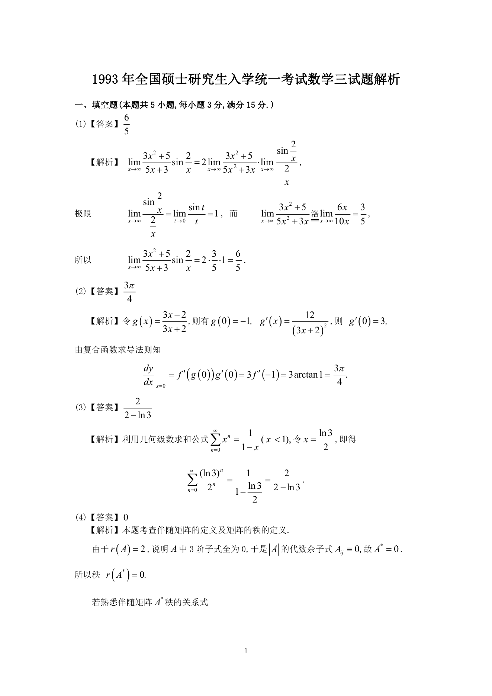

# 1993 数学三第 1 题

## 题目

$\lim_{x \to \infty} \frac{3x^2 + 5}{5x + 3}\sin \frac{2}{x} =$ \underline{\qquad}．

## 标准答案

见答案解析页图

## 解析

该题答案见下方答案解析页图；PDF 文本层顺序和公式不稳定，未直接转写为标准 LaTeX 文本。

## 答案解析页图

## 来源

- 题目来源：1993 年数学三 TeX 试卷源（试卷四）。
- 答案解析来源：1993年数学三真题答案解析.pdf。
- 页面图只作为原卷/解析复核依据；题干正文已按 TeX 源整理为 LaTeX。
